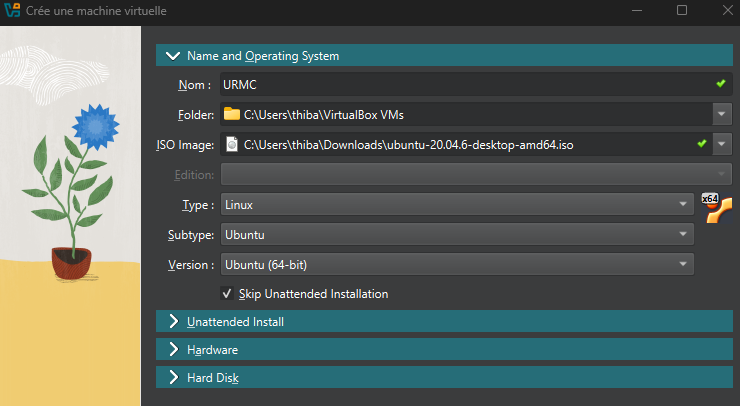
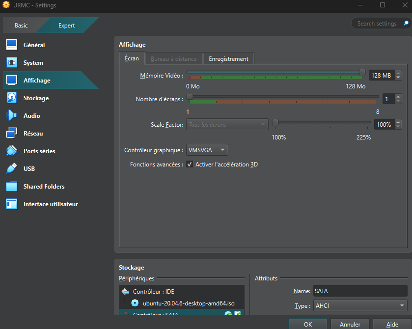

Installation de Linux sur VirtualBox
===================================

Prérequis
---------

- Téléchargez l'image ISO de Ubuntu 20.04  depuis le site officiel de Ubuntu (desktop) : https://releases.ubuntu.com/focal/
- Téléchargez et installez Oracle VM VirtualBox depuis le site officiel de VirtualBox : https://www.virtualbox.org/wiki/Downloads 

Création de la machine virtuelle
-------------------------------

1. Ouvrez VirtualBox.
2. Cliquez sur "Nouvelle" pour créer une nouvelle machine virtuelle.
3. Donnez un nom à la machine virtuelle (par exemple "Ubuntu 20.04") et sélectionnez le type "Linux" et la version "Ubuntu (64 bits)".
4. Chargez l'image ISO d'Ubuntu 20.04 que vous avez téléchargée.
5. Cliquez sur "Skip Unattended Installation"

6. Créez un domaine d'utilisateur, Username et Password. 
7. Définissez la taille de la mémoire vive (RAM) allouée à la machine virtuelle (minimum 4 Go recommandé).

.. image:: pictures/3Ram.png
   :alt: choix ram vm
   :width: 600
   :align: center

8. Créez un nouveau disque dur virtuel avec une taille minimale de 25 Go.

.. image:: pictures/4Espace_disque.png
   :alt: choix espace disque vm
   :width: 600
   :align: center

9. Cliquez sur "Créer" pour finaliser la création de la machine virtuelle.

Avant de lancer la machine virtuelle, vous devez configurer quelques paramètres supplémentaires :
Selectionnez la machine virtuelle, appuyez sur configuration et allez dans l'onglet "Expert" en haut à gauche puis "Affichage" et activez, si votre ordinateur le permet, l'accélération graphique et et augmentez la mémoire vidéo.
Cela permet d'améliorer les performances graphiques de la machine virtuelle, ce qui sera particulèrement utile pour utiliser le logiciel de simulation Gazebo.

Configuration de la machine virtuelle
-------------------------------------
1. Sélectionnez la machine virtuelle dans la liste et cliquez sur "Démarrer".
2. Suivez les étapes d'installation d'Ubuntu, en choisissant les paramètres de votre choix.
3. Une fois l'installation terminée, connectez-vous avec les identifiants que vous avez créés.

Configuration du clavier et de la résolution
--------------------------------------------

1. Modifiez la configuration du clavier pour passer d'un clavier QWERTY à AZERTY :
   
   - Allez dans les paramètres système, dans la section "Langues et région".
   - Cliquez sur "Gérer les langues installées" et ajoutez le français comme langue.
   - Sélectionnez le français comme langue par défaut.
   - 
2. Modifiez la résolution de l'écran de la machine virtuelle pour qu'elle soit identique à votre écran hôte :
   
   - Dans les paramètres de la machine virtuelle, allez dans l'onglet "Écran".
   - Ajustez la "Définition" en fonction de la résolution de votre écran.

Vous pouvez maintenant utiliser votre machine virtuelle Ubuntu 20.04 sur VirtualBox !