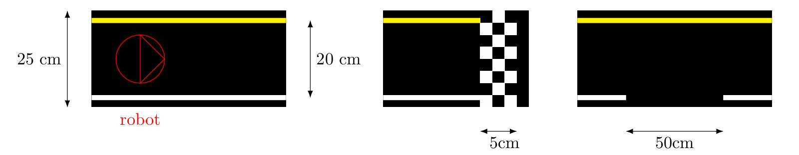
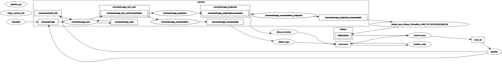

Mission 1 : Qualification et Navigation Autonome
===============================================

Description de l'Épreuve
-----------------------

La mission 1 du tournoi de Turtlebot représente un défi complexe de navigation autonome, divisé en deux phases distinctes qui testent les capacités de perception et de suivi de ligne du robot.

Première Phase : Qualification
^^^^^^^^^^^^^^^^^^^^^^^^^^^^^

Le parcours de qualification s'étend sur une distance d'environ 1,5 mètre. Il comprend une trajectoire composée d'une ligne droite suivie d'une courbe, délimitée par une ligne blanche à droite et une ligne jaune à gauche. 

Le point de départ est matérialisé par un cercle blanc centré sur la piste. Le robot doit suivre ce tracé avec précision et s'arrêter uniquement lorsqu'il détecte une ligne transversale en damier noir et blanc.

Deuxième Phase : Navigation Avancée
^^^^^^^^^^^^^^^^^^^^^^^^^^^^^^^^^^^

Cette phase présente des contraintes supplémentaires. Le parcours reste similaire, combinant une ligne droite et une courbe. Cependant, les lignes de délimitation (blanches et jaunes) peuvent être interrompues sur une distance de 50 cm, ajoutant de la complexité à la navigation.

L'objectif final est de détecter et de s'arrêter devant un panneau de signalisation STOP standardisé, mesurant précisément 5 × 5 cm.

Architecture 
---------------------

L'implémentation repose sur une architecture modulaire de nœuds ROS, chacun ayant une responsabilité spécifique dans la navigation autonome.

Nœud Maître
^^^^^^^^^^^

Le master_node joue un rôle central de coordination. Il contrôle le démarrage et l'arrêt des différentes phases de la mission, en publiant des commandes sur le topic `/command`.

Nœuds de Perception
^^^^^^^^^^^^^^^^^^

Plusieurs nœuds sont dédiés à la perception de l'environnement. Le nœud de suivi de ligne, basé sur le code Robotis, analyse les flux de la caméra pour caractériser le tracé. Un nœud de contrôle de lane traduit ces informations en commandes de pilotage, ajustant trajectoire et vitesse.

Des nœuds spécialisés gèrent la détection du damier et du panneau STOP, déclenchant les arrêts aux moments critiques de la mission en publiant "0" sur le topic /command.

Dans le dossier mission1, un dossier "pictures" a été crée, qui contient les images du damier et du panneau STOP. Il faut les modifiees en plaçant le robot devant le damier et le panneau STOP, et en enregistrant les images sous les noms damier.png et stop.png.

Nœud de contrôle
^^^^^^^^^^^^^^^^

Le noeud control_lane est responsable de la gestion de la vitesse et de l'orientation du robot. Il reçoit les commandes de suivi de ligne et les traduit en actions motrices, ajustant les vitesses des roues pour suivre la trajectoire souhaitée. Il permet également de stopper le robot si un "0" est reçu sur /command.

Node Graph
^^^^^^^^^^

Démonstration 
---------------------

Détection de damier
^^^^^^^^^^^^^^^^^^^

.. raw:: html

    <video width="640" height="360" controls>
        <source src="" type="videos/damier.webm">
    </video>

Programmes 
---------------------

Lancement de la Mission 1 : 
^^^^^^^^^^^^^^^^^^^^^^^^^^^^

.. code-block:: bash

    roslaunch tournoi mission1.launch

Fichier launch
^^^^^^^^^^^^^^

Ce fichier launch est utilisé pour configurer et lancer les différentes noeuds nécéssaires à la mission 1. Il inclut les étapes suivantes :

- Lancer la calibration intrinsèque de la caméra, qui ajuste les paramètres internes de la caméra.
- Lancer la calibration extrinsèque de la caméra, qui ajuste la position et l'orientation de la caméra par rapport au robot.
- Définir les paramètres de calibration de la caméra, tels que les coordonnées de projection de l'image et les paramètres de compensation de l'image.
- Lancer la détection de ligne, qui analyse les images de la caméra pour suivre la trajectoire.
- Lancer le nœud maître, qui coordonne les différentes étapes de la mission.
- Lancer le contrôle de lane, qui ajuste la vitesse et l'orientation du robot en fonction des informations de détection de ligne.
- Lancer le nœud de détection du panneau STOP, qui envoie "0" sur /command pour stopper le robot lorsqu'il détecte le panneau STOP.
- Lancer le nœud de détection du damier,  qui envoie "0" sur /command pour stopper le robot lorsqu'il détecte le damier.

.. code-block:: bash

    <launch>
        <arg name="mode" default="default_value"/>
        
        <!-- Lancer la calibration intrinsèque de la caméra -->
        <include file='$(find turtlebot3_autorace_camera)/launch/intrinsic_camera_calibration.launch' />

        <!-- Lancer la calibration extrinsèque de la caméra -->
        <include file='$(find turtlebot3_autorace_camera)/launch/extrinsic_camera_calibration.launch' />
        
        <!-- Paramètres de calibration de la caméra -->
        <group ns="camera">
        <group ns="image_projection">
        <param name="top_x" value="41" />
        <param name="top_y" value="19" />
        <param name="bottom_x" value="83" />
        <param name="bottom_y" value="76" />
        </group>
        <group ns="image_compensation_projection">
        <param name="clip_hist_percent" value="1.0" />
        </group>
        </group>
    
    
        <!-- lane detection -->
        <node pkg="tournoi" type="detect_lane.py" name="$(anon detect_lane)" output="screen">
            <rosparam command="load" file="$(find tournoi)/param/lane/lane.yaml" />
            <param if="$(eval mode == 'calibration')" name="/is_detection_calibration_mode" value="True"/>
            <param if="$(eval mode == 'action')" name="/is_detection_calibration_mode" value="False"/>
            <remap from="/detect/image_input" to="/camera/image_projected_compensated" />
            <remap from="/detect/image_input/compressed" to="/camera/image_projected_compensated/compressed" />
            <remap from="/detect/image_output" to="/detect/image_lane" />
            <remap from="/detect/image_output/compressed" to="/detect/image_lane/compressed" />
            <remap from="/detect/image_output_sub1" to="/detect/image_white_lane_marker" />
            <remap from="/detect/image_output_sub1/compressed" to="/detect/image_white_lane_marker/compressed" />
            <remap from="/detect/image_output_sub2" to="/detect/image_yellow_lane_marker" />
            <remap from="/detect/image_output_sub2/compressed" to="/detect/image_yellow_lane_marker/compressed" />
        </node>

        <!-- Master node avec gestion de l'arrêt -->
        <node pkg="tournoi" name="master_node" type="master_node.py" output="screen" required="false" respawn="false">
        </node>

        <!-- lane control -->
        <node pkg="tournoi" type="control_lane.py" name="control_lane" output="screen">
            <remap from="/control/lane" to="/detect/lane" />
            <remap from="/control/cmd_vel" to="/cmd_vel" />
        </node>

        <!-- stop at damier -->
        <node pkg="tournoi" type="stop_at_damier.py" name="stop_at_damier" output="screen">
            <remap from="/camera/image_raw" to="/camera/image_raw" />
            <remap from="/cmd_vel" to="/cmd_vel" />
            <remap from="/command" to="/command" />
        </node>

            <!-- détection panneau stop -->
        <node pkg="tournoi" type="detect_stop_sign.py" name="detect_sign" output="screen">
            <param name="sub_image_type" value="raw" />  <!-- ou "compressed" selon ton choix -->
            <remap from="/detect/image_input" to="/camera/image_raw" />
            <remap from="/detect/traffic_sign" to="/detect/traffic_sign" />
            <remap from="/detect/image_output" to="/detect/image_output" />
            <remap from="/detect/image_input" to="/camera/image_compensated" />
            <remap from="/detect/image_input/compressed" to="/camera/image_compensated/compressed" />
            <remap from="/detect/image_output" to="/detect/image_traffic_sign" />
            <remap from="/detect/image_output/compressed" to="/detect/image_traffic_sign/compressed" />   
        </node>

    </launch>

master_node.py
^^^^^^^^^^^^^^

.. code-block:: bash

    master_node.py
    #!/usr/bin/env python
    # -*- coding: utf-8 -*-
    # Author: PALISSE Volia, WAECHTER Thibaut, YOUBI Lounès

    import rospy
    from std_msgs.msg import UInt8
    import sys
    import select
    import termios
    import tty
    import signal

    class MasterNode:
        def __init__(self):
            # Initialisation du publisher et subscriber
            self.pub_command = rospy.Publisher('/command', UInt8, queue_size=1)
            self.sub_command = rospy.Subscriber('/command', UInt8, self.command_callback, queue_size=1)
            self.command_state = 0  # 0 = désactivé, 1 = activé
            self.settings = termios.tcgetattr(sys.stdin)
            
            rospy.loginfo(f"\nÉtat initial de la commande: {self.command_state}")

        def command_callback(self, command_msg):
            self.command_state = command_msg.data
            rospy.loginfo(f"\nNouvelle valeur de commande reçue: {self.command_state}")

        def get_key(self):
            try:
                tty.setraw(sys.stdin.fileno())
                rlist, _, _ = select.select([sys.stdin], [], [], 0.1)
                if rlist:
                    key = sys.stdin.read(1)
                else:
                    key = ''
            finally:
                termios.tcsetattr(sys.stdin, termios.TCSADRAIN, self.settings)
            return key

        def run(self):
            rospy.loginfo("\nAppuyez sur ESPACE pour alterner l'état du topic /command entre 0 et 1")
            
            while not rospy.is_shutdown():
                key = self.get_key()
                
                if key == ' ':
                    self.command_state = 1 if self.command_state == 0 else 0
                    rospy.loginfo(f"Command: {self.command_state}")
                    self.pub_command.publish(self.command_state)
                elif key == '\x03':  # Ctrl+C
                    rospy.loginfo("\nArrêt du robot.")
                    termios.tcsetattr(sys.stdin, termios.TCSADRAIN, self.settings)
                    rospy.signal_shutdown("\nArrêt demandé par l'utilisateur")
                    break

    def main():
        rospy.init_node('master_node')
        
        try:
            node = MasterNode()
            node.run()
        except rospy.ROSInterruptException:
            termios.tcsetattr(sys.stdin, termios.TCSADRAIN, node.settings)
        except Exception as e:
            rospy.logerr(f"Erreur: {str(e)}")
            termios.tcsetattr(sys.stdin, termios.TCSADRAIN, termios.tcgetattr(sys.stdin.fileno()))

    if __name__ == '__main__':
        main()

stop_at_damier.py
^^^^^^^^^^^^^^^^^

.. code-block:: bash

    #!/usr/bin/env python 
    # Author: PALISSE Volia, WAECHTER Thibaut, YOUBI Lounès

    from sensor_msgs.msg import CompressedImage
    from std_msgs.msg import UInt8
    from cv_bridge import CvBridge
    import numpy as np
    import rospkg
    import cv2
    import rospy

    class StopAtDamier:
        def __init__(self):
            rospy.init_node('stop_at_damier')
            self.bridge = CvBridge()
            self.image_sub = rospy.Subscriber('/camera/image_projected/compressed', CompressedImage, self.image_callback)
            self.command_pub = rospy.Publisher('/command', UInt8, queue_size=10)
            
            # Flag pour gérer l'état de détection
            self.damier_detected = False
            self.command = UInt8()

            # Utiliser rospkg pour obtenir le chemin absolu de l'image
            rospack = rospkg.RosPack()
            package_path = rospack.get_path('tournoi')  
            image_path = package_path + '/scripts/mission_1/pictures/damier.png'

            # Charger l'image de référence du damier
            try:
                self.reference_image = cv2.imread(image_path, cv2.IMREAD_GRAYSCALE)
                if self.reference_image is None:
                    rospy.logwarn(f"Erreur lors du chargement de l'image de référence à {image_path}")
            except Exception as e:
                rospy.logerr(f"Erreur lors du chargement de l'image de référence : {e}")
                self.reference_image = None

        def image_callback(self, data):
            try:
                np_arr = np.frombuffer(data.data, np.uint8)
                cv_image = cv2.imdecode(np_arr, cv2.IMREAD_GRAYSCALE)
            except Exception as e:
                print(f"Erreur lors du traitement de l'image : {e}")
                return

            if self.reference_image is not None:
                # Redimensionner l'image de référence à la taille de l'image reçue
                ref_image = cv2.resize(self.reference_image, (cv_image.shape[1], cv_image.shape[0]))

                # Comparer l'image du topic avec l'image de référence
                result = cv2.matchTemplate(cv_image, ref_image, cv2.TM_CCOEFF_NORMED)
                min_val, max_val, min_loc, max_loc = cv2.minMaxLoc(result)

                # Si le score de correspondance est élevé, on détecte un damier
                if max_val > 0.6:
                    if not self.damier_detected:
                        rospy.loginfo("Damier détecté, attente avant arrêt")
                        self.damier_detected = True
                        rospy.sleep(5)  # Délai 
                        self.publish_command(0)  # Publie le signal d'arrêt après le délai

        def publish_command(self, value):
            self.command.data = value
            self.command_pub.publish(self.command)

        def run(self):
            rate = rospy.Rate(10)
            while not rospy.is_shutdown():
                rate.sleep()

    if __name__ == '__main__':
        try:
            node = StopAtDamier()
            node.run()
        except rospy.ROSInterruptException:
            pass

control_lane.py
^^^^^^^^^^^^^^^^

.. code-block:: bash

    #!/usr/bin/env python
    # -*- coding: utf-8 -*

    # Author: Leon Jung, Gilbert, Ashe Kim
    # PALISSE Volia, WAECHTER Thibaut, YOUBI Lounès
    
    #!/usr/bin/env python
    # -*- coding: utf-8 -*-

    import rospy
    import numpy as np
    from std_msgs.msg import Float64, UInt8
    from geometry_msgs.msg import Twist

    class ControlLane():
        def __init__(self):
            self.sub_lane = rospy.Subscriber('/control/lane', Float64, self.cbFollowLane, queue_size = 1)
            self.sub_max_vel = rospy.Subscriber('/control/max_vel', Float64, self.cbGetMaxVel, queue_size = 1)
            self.sub_command = rospy.Subscriber('/command', UInt8, self.cbCommand, queue_size = 1)  # Ajout du topic /command
            self.pub_cmd_vel = rospy.Publisher('/control/cmd_vel', Twist, queue_size = 1)

            self.lastError = 0
            self.MAX_VEL = 0.2
            self.follow_lane = False  # Variable pour suivre ou non la ligne

            rospy.on_shutdown(self.fnShutDown)

        def cbGetMaxVel(self, max_vel_msg):
            self.MAX_VEL = max_vel_msg.data

        def cbCommand(self, command_msg):
            #Callback pour gérer les commandes activant ou désactivant le suivi.
            if command_msg.data == 1:
                rospy.loginfo("Suivi de ligne activé")
                rospy.loginfo("\n")
                self.follow_lane = True
            elif command_msg.data == 0:
                rospy.loginfo("Suivi de ligne désactivé")
                rospy.loginfo("\n")
                self.follow_lane = False
                self.fnShutDown()  # Arrêter le robot immédiatement si désactivé

        def cbFollowLane(self, desired_center):
            #Callback pour suivre la ligne uniquement si activé.
            if not self.follow_lane:
                return  # Ne rien faire si le suivi est désactivé

            center = desired_center.data

            error = center - 500

            Kp = 0.0025
            Kd = 0.007

            angular_z = Kp * error + Kd * (error - self.lastError)
            self.lastError = error
            
            twist = Twist()
            twist.linear.x = min(self.MAX_VEL * ((1 - abs(error) / 500) ** 2.2), 0.05)
            twist.angular.z = -max(angular_z, -2.0) if angular_z < 0 else -min(angular_z, 2.0)
            self.pub_cmd_vel.publish(twist)

        def fnShutDown(self):
            #Arrêter le robot en mettant toutes les vitesses à 0.
            rospy.loginfo("Arrêt du robot")
            twist = Twist()
            twist.linear.x = 0
            twist.angular.z = 0
            self.pub_cmd_vel.publish(twist) 

        def main(self):
            rospy.spin()

    if __name__ == '__main__':
        rospy.init_node('control_lane')
        node = ControlLane()
        node.main()
