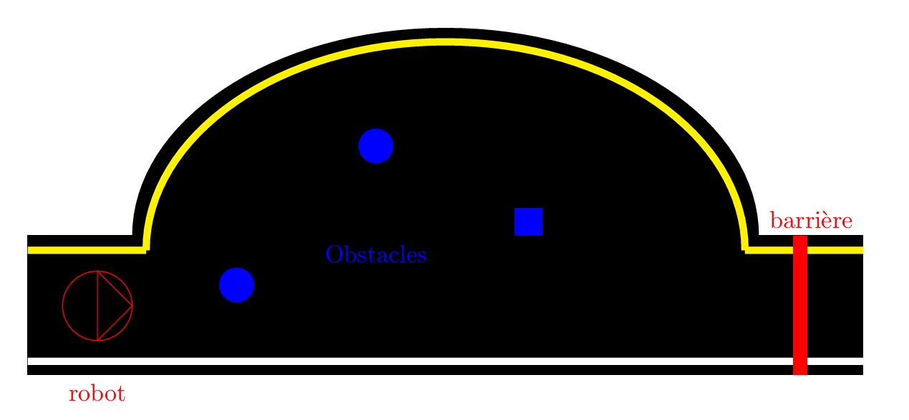

==================================================
Mission 2 : Suivi de ligne et évitement d'obstacles
==================================================

Description de l'épreuve
------------------------

Dans cette mission, le TurtleBot doit naviguer sur un chemin délimité par des lignes blanche et jaune, tout en évitant des obstacles placés aléatoirement et en s'arrêtant devant une barrière fermant la route.

Architecture du système
----------------------

Noeud Maître (Master Node)
~~~~~~~~~~~~~~~~~~~~~~~~~

Le ``master_node`` joue un rôle central de coordination. Il contrôle le démarrage et l'arrêt des différentes phases de la mission en publiant des commandes sur le topic ``/command``.

Noeuds de Perception
~~~~~~~~~~~~~~~~~~~

**Noeud de détection de ligne** :

- Responsable de l'identification et du suivi de la ligne blanche
- Utilise des algorithmes de traitement d'image pour détecter la trajectoire

**Noeud de détection d'obstacles** :

- Détecte et localise les obstacles présents sur la trajectoire à l'aide du
- Utilise le Lidar pour identifier les obstacles
  
**Noeud de détection de la barrière** :

- Détecte la barrière fermant la route, en analysant la quantité de rouge dans l'image renvoyée par la caméra

Noeuds de Contrôle
~~~~~~~~~~~~~~~~~

**Noeud de contrôle de trajectoire (lane_control)** :

- Permet au robot de suivre précisément la ligne blanche
- Ajuste continuellement la direction du robot
- Se coupe automatiquement en cas d'obstacle

**Noeud de détection et évitement d'obstacles (detect_obstacle)** :

- Analyse les obstacles détectés
- Planifie et exécute des manœuvres d'évitement
- Se lance seulement si un obstacle est détecté

Logique de Navigation
--------------------

La logique de navigation est basée sur plusieurs règles et comportements :

1. **Suivi de ligne** :
   
   - Le robot suit initialement la ligne blanche de manière autonome
   - Maintient une trajectoire stable et centrée sur la ligne

2. **Détection du premier obstacle** :
   
   - Lors de la détection d'un obstacle, le robot enregistre son cap (orientation) actuel à l'aide de l'IMU (Unité de Mesure Inertielle)

3. **Stratégies d'évitement** :
   
   - Si ligne blanche + obstacle détecté => Rotation à gauche
   - Tente de longer la ligne blanche en tournant à droite si possible

4. **Contrôle de l'orientation** :
   
   - Utilisation du cap initial pour limiter la rotation du robot
   - Si la différence entre l'orientation actuelle et le cap initial est trop grande, correction automatique vers le cap initial

Node Graph
^^^^^^^^^^

Démonstration 
---------------------

Programmes 
---------------------

Lancement de la Mission 2 : 
^^^^^^^^^^^^^^^^^^^^^^^^^^^^

.. code-block:: bash

    roslaunch tournoi mission2.launch

Fichier launch
^^^^^^^^^^^^^^

Le fichier launch de la mission 2 configure et initialise plusieurs noeuds essentiels au fonctionnement du robot :

- Calibration Intrinsèque et Extrinsèque de la Caméra : Ces étapes préparent la caméra en ajustant ses paramètres internes et sa position sur le robot. La calibration intrinsèque corrige les distorsions optiques, tandis que la calibration extrinsèque définit précisément l'orientation de la caméra par rapport au robot.
- Paramètres de Calibration de la Caméra : Un groupe de paramètres définit les coordonnées de projection de l'image (points supérieur et inférieur) et les paramètres de compensation, optimisant le traitement et l'analyse des images.
- Nœud de Détection de Ligne (detect_lane_2.py) : Ce nœud analyse les images de la caméra pour détecter et suivre la trajectoire. Il fonctionne en deux modes (calibration ou action) et génère des images de sortie pour les marqueurs de ligne blanche et jaune, permettant une détection précise de la trajectoire.
- Nœud Maître (master_node_2.py) : C'est le coordinateur central de la mission. Il gère le démarrage, l'arrêt et la synchronisation des différentes étapes, orchestrant les actions du robot de manière cohérente.
- Nœud de Contrôle de Trajectoire (control_lane_2.py) : Ce nœud ajuste dynamiquement la vitesse et l'orientation du robot en se basant sur les informations de détection de ligne. Il assure que le robot suive précisément la trajectoire détectée.
- Nœud de Détection d'Obstacles (detect_obstacle.py) : Responsable de l'identification et de la localisation des obstacles sur le chemin du robot. Il permet au système de planifier des manœuvres d'évitement en temps réel.
- Nœud de Détection de Barrière (detect_barriere.py) : Ce nœud surveille spécifiquement la présence d'une barrière sur le chemin du robot. Il est crucial pour la mission, car il permet d'arrêter le robot lorsqu'une barrière est détectée.

.. code-block:: bash

    <launch>
        <arg name="mode" default="default_value"/>
        
        <!-- Lancer la calibration intrinsèque de la caméra -->
        <include file='$(find turtlebot3_autorace_camera)/launch/intrinsic_camera_calibration.launch' />

        <!-- Lancer la calibration extrinsèque de la caméra -->
        <include file='$(find turtlebot3_autorace_camera)/launch/extrinsic_camera_calibration.launch' />
        
        <!-- Paramètres de calibration de la caméra -->
    <group ns="camera">
        <group ns="image_projection">
        <param name="top_x" value="41" />
        <param name="top_y" value="19" />
        <param name="bottom_x" value="83" />
        <param name="bottom_y" value="76" />
        </group>
        <group ns="image_compensation_projection">
        <param name="clip_hist_percent" value="1.0" />
        </group>
    </group>
    
        <!-- lane detection -->
        <node pkg="tournoi" type="detect_lane_2.py" name="$(anon detect_lane_2)" output="screen">
            <rosparam command="load" file="$(find tournoi)/param/lane/lane.yaml" />
            <param if="$(eval mode == 'calibration')" name="/is_detection_calibration_mode" value="True"/>
            <param if="$(eval mode == 'action')" name="/is_detection_calibration_mode" value="False"/>
            <remap from="/detect/image_input" to="/camera/image_projected_compensated" />
            <remap from="/detect/image_input/compressed" to="/camera/image_projected_compensated/compressed" />
            <remap from="/detect/image_output" to="/detect/image_lane" />
            <remap from="/detect/image_output/compressed" to="/detect/image_lane/compressed" />
            <remap from="/detect/image_output_sub1" to="/detect/image_white_lane_marker" />
            <remap from="/detect/image_output_sub1/compressed" to="/detect/image_white_lane_marker/compressed" />
            <remap from="/detect/image_output_sub2" to="/detect/image_yellow_lane_marker" />
            <remap from="/detect/image_output_sub2/compressed" to="/detect/image_yellow_lane_marker/compressed" />
        </node>

        <!-- Master node avec gestion de l'arrêt -->
        <node pkg="tournoi" name="master_node_2" type="master_node_2.py" output="screen" required="false" respawn="false">
        </node>

        <!-- lane control -->
        <node pkg="tournoi" type="control_lane_2.py" name="control_lane_2" output="screen">
            <remap from="/control/lane" to="/detect/lane" />
            <remap from="/control/cmd_vel" to="/cmd_vel" />
        </node>

        <node pkg="tournoi" type="detect_obstacle.py" name="detect_obstacle" output="screen">
        </node>

        <node pkg="tournoi" type="detect_barriere.py" name="detect_barriere" output="screen">
        </node>
    
    </launch>

master_node_2.py
^^^^^^^^^^^^^^^^

.. code-block:: bash

    master_node_2.py
    #!/usr/bin/env python
    # -*- coding: utf-8 -*-
    # Author: PALISSE Volia, WAECHTER Thibaut, YOUBI Lounès

    import rospy
    from std_msgs.msg import UInt8
    import sys
    import select
    import termios
    import tty
    import signal
    from geometry_msgs.msg import Twist

    class MasterNode:
        def __init__(self):
            # Initialisation du publisher et subscriber
            self.pub_command = rospy.Publisher('/command', UInt8, queue_size=1)
            self.sub_command = rospy.Subscriber('/command', UInt8, self.command_callback, queue_size=1)
            self.command_state = 0  # 0 = désactivé, 1 = activé
            self.cmd_vel_publisher = rospy.Publisher('/cmd_vel', Twist, queue_size=10)

            self.settings = termios.tcgetattr(sys.stdin)
            self.twist = Twist()

            rospy.loginfo(f"\n \rÉtat initial de la commande: {self.command_state}")

        def command_callback(self, command_msg):
            self.command_state = command_msg.data
            rospy.loginfo(f"\n \rNouvelle valeur de commande reçue: {self.command_state}")
            if self.command_state == 0:
                self.stop_robot()

        def get_key(self):
            try:
                tty.setraw(sys.stdin.fileno())
                rlist, _, _ = select.select([sys.stdin], [], [], 0.1)
                if rlist:
                    key = sys.stdin.read(1)
                else:
                    key = ''
            finally:
                termios.tcsetattr(sys.stdin, termios.TCSADRAIN, self.settings)
            return key
        
        def stop_robot(self):
            self.twist.linear.x = 0.0
            self.twist.angular.z = 0.0
            self.cmd_vel_publisher.publish(self.twist)

        def run(self):
            rospy.loginfo("\nAppuyez sur ESPACE pour alterner l'état du topic /command entre 0 et 1")
            
            while not rospy.is_shutdown():
                key = self.get_key()
                
                if key == ' ':
                    self.command_state = 1 if self.command_state == 0 else 0
                    rospy.loginfo(f"Command: {self.command_state}")
                    self.pub_command.publish(self.command_state)
                elif key == '\x03':  # Ctrl+C
                    rospy.loginfo("\nArrêt du robot.")
                    termios.tcsetattr(sys.stdin, termios.TCSADRAIN, self.settings)
                    self.stop_robot()
                    rospy.signal_shutdown("\nArrêt demandé par l'utilisateur")
                    break

    def main():
        rospy.init_node('master_node')
        
        try:
            node = MasterNode()
            node.run()
        except rospy.ROSInterruptException:
            termios.tcsetattr(sys.stdin, termios.TCSADRAIN, node.settings)
        except Exception as e:
            rospy.logerr(f"Erreur: {str(e)}")
            termios.tcsetattr(sys.stdin, termios.TCSADRAIN, termios.tcgetattr(sys.stdin.fileno()))

    if __name__ == '__main__':
        main()

detect_obstacle.py
^^^^^^^^^^^^^^^^^^

.. code-block:: bash

    #!/usr/bin/env python
    # -*- coding: utf-8 -*-
    # Author: PALISSE Volia, WAECHTER Thibaut, YOUBI Lounès

    import rospy
    import math
    from sensor_msgs.msg import LaserScan, Imu
    from geometry_msgs.msg import Twist
    from std_msgs.msg import UInt8
    from tf.transformations import euler_from_quaternion
    from nav_msgs.msg import Odometry

    class ObjectAvoidance:
        def __init__(self):
            rospy.init_node('object_avoidance_node', anonymous=True)
            self.evitement = False

            # Subscribers
            self.scan_subscriber = rospy.Subscriber('/scan', LaserScan, self.scan_callback)
            self.imu_subscriber = rospy.Subscriber('/imu', Imu, self.imu_callback)
            self.sub_command = rospy.Subscriber('/command', UInt8, self.cbCommand, queue_size=1)
            self.sub_suivi_de_ligne = rospy.Subscriber('/Suivi_de_ligne', UInt8, self.cbSuiviDeLigne, queue_size=1)
            self.sub_yellow_line = rospy.Subscriber('/detect/yellow_line_detected', UInt8, self.cbYellowLine, queue_size=1)
            self.sub_white_line = rospy.Subscriber('/detect/white_line_detected', UInt8, self.cbWhiteLine, queue_size=1)
            self.odom_subscriber = rospy.Subscriber('/odom', Odometry, self.odom_callback)
            self.robot_x_position = 0.0

            # Publishers
            self.cmd_vel_publisher = rospy.Publisher('/cmd_vel', Twist, queue_size=10)
            self.cmd_contournement = rospy.Publisher('/contournement', UInt8, queue_size=1)
            
            # Variables d'état
            self.twist = Twist()
            self.first_obstacle_detected = False
            self.avoiding = False
            self.target_yaw = None
            self.current_yaw = 0.0
            self.heading=0
            self.last_turn_direction = None
            self.saved_x_position = 0.0
            self.clearance_distance = 0.0
            
            # État du suivi de ligne
            self.suivi_de_ligne_actif = False
            self.yellow_line_detected = False
            self.white_line_detected = False
            self.white_line_detection_count = 0  # Compteur pour les détections de la ligne blanche
            
            # Paramètres ajustés
            self.threshold_distance = 0.40  # Distance de détection d'obstacle
            self.safe_distance = 0.35      # Distance de sécurité standard
            self.very_safe_distance = 0.45  # Distance de sécurité étendue
            self.linear_speed = 0.15        # Vitesse linéaire standard
            self.angular_speed = 0.8       # Vitesse angulaire standard
            self.return_angular_speed = 1.0 # Vitesse angulaire pour retour au cap
            self.angle_tolerance = 0.1     # Tolérance d'angle réduite pour plus de précision
            self.slow_speed = 0.05         # Vitesse lente pour les manœuvres précises
            self.side_check_distance = 0.4  # Distance de vérification latérale

        def odom_callback(self, odom_msg):
            self.robot_x_position = odom_msg.pose.pose.position.x
            if self.avoiding:
                self.clearance_distance = abs(self.robot_x_position - self.saved_x_position)
            
        def cbCommand(self, command_msg):
            if command_msg.data == 1:
                self.evitement = True
            elif command_msg.data == 0:
                self.reset_state()

        def reset_state(self):
            self.evitement = False
            self.first_obstacle_detected = False
            self.avoiding = False
            self.target_yaw = None
            self.last_turn_direction = None
            self.robot_x_position = 0.0
            self.clearance_distance = 0.0

        def cbSuiviDeLigne(self, msg):
            if msg.data == 1:
                self.suivi_de_ligne_actif = 1
            else :
                self.suivi_de_ligne_actif = 0
            
        def cbYellowLine(self, msg):
            self.yellow_line_detected = msg.data == 1
            
        def cbWhiteLine(self, msg):
            if msg.data == 1:
                self.white_line_detection_count += 1
            else:
                self.white_line_detection_count = 0
            
            # Considérer la ligne blanche comme détectée uniquement si le compteur atteint 10
            self.white_line_detected = self.white_line_detection_count >= 4
                
        def stop_robot(self):
            if not self.suivi_de_ligne_actif:
                self.twist.linear.x = 0.0
                self.twist.angular.z = 0.0
                self.cmd_vel_publisher.publish(self.twist)

        def imu_callback(self, imu_msg):
            orientation_q = imu_msg.orientation
            orientation_list = [orientation_q.x, orientation_q.y, orientation_q.z, orientation_q.w]
            roll, pitch, yaw = euler_from_quaternion(orientation_list)
            self.current_yaw = yaw
            
            if self.evitement and self.target_yaw is None:
                self.target_yaw = yaw
        
        def get_angle_difference(self):
            if self.target_yaw is None:
                return 0.0
                
            diff = self.target_yaw - self.current_yaw
            # Normalisation de l'angle entre -pi et pi
            return math.atan2(math.sin(diff), math.cos(diff))

        def scan_callback(self, scan_data):
            if not self.evitement:
                return

            # Analyse des distances
            front_center = scan_data.ranges[355:360] + scan_data.ranges[0:5]
            front_left = scan_data.ranges[5:25]
            front_right = scan_data.ranges[335:355]
            side_left = scan_data.ranges[25:45]
            side_right = scan_data.ranges[315:335]
            
            def filter_ranges(ranges):
                return [x for x in ranges if scan_data.range_min < x < scan_data.range_max]
                
            front_center_dist = min(filter_ranges(front_center) or [float('inf')])
            front_left_dist = min(filter_ranges(front_left) or [float('inf')])
            front_right_dist = min(filter_ranges(front_right) or [float('inf')])
            side_left_dist = min(filter_ranges(side_left) or [float('inf')])
            side_right_dist = min(filter_ranges(side_right) or [float('inf')])
            
            msg = UInt8()
            angle_diff = self.get_angle_difference()
            self.avoiding = (front_center_dist < self.threshold_distance 
                            or front_left_dist < self.threshold_distance 
                            or front_right_dist < self.threshold_distance 
                            or side_left_dist < self.threshold_distance 
                            or side_right_dist < self.threshold_distance)

            if self.avoiding:
                rospy.loginfo("\r Évitement en cours")

            # Détection du premier obstacle
            if front_center_dist < self.threshold_distance and not self.first_obstacle_detected:
                self.handle_first_obstacle(front_left_dist, front_right_dist)
                msg.data = 1
                self.heading = self.target_yaw

            
            # Gestion de l'évitement en cours
            elif self.first_obstacle_detected :
                self.handle_ongoing_avoidance(
                    front_center_dist, front_left_dist, front_right_dist,
                    side_left_dist, side_right_dist, angle_diff
                )
                msg.data = self.avoiding
                self.cmd_vel_publisher.publish(self.twist)

            else:
                msg.data = 0 
            self.cmd_contournement.publish(msg)

        def handle_first_obstacle(self, front_left_dist, front_right_dist):
            self.first_obstacle_detected = True
            self.avoiding = True
            self.saved_x_position = self.robot_x_position
            
            # Décision de la direction de rotation
            if self.white_line_detected:
                self.last_turn_direction = "left"
                rospy.loginfo("gauche")

                turn_direction = 1
            else:
                self.last_turn_direction = "right"
                rospy.loginfo("droite")

                turn_direction = -1
            
            # Application de la rotation
            self.twist.angular.z = turn_direction * self.angular_speed
            self.twist.linear.x = self.slow_speed

        def handle_ongoing_avoidance(self, front_dist, front_left_dist, front_right_dist,
                                side_left_dist, side_right_dist, angle_diff):
            # Vérification si on peut retourner vers le cap initial
            safe_to_return = (
                front_dist > self.safe_distance and
                side_left_dist > self.side_check_distance and
                side_right_dist > self.side_check_distance and
                abs(angle_diff) > self.angle_tolerance
            )
            bla = False
            if safe_to_return and bla:
                self.handle_return_to_heading(angle_diff)
                rospy.loginfo("\n \r Return to heading")

            else:
                rospy.loginfo("\n \r obstacle")
                self.handle_obstacle_avoidance(
                    front_dist, front_left_dist, front_right_dist,
                    side_left_dist, side_right_dist,angle_diff
                    
                )

        def handle_return_to_heading(self, angle_diff):
            self.avoiding = False
            # Augmentation de la vitesse de rotation pour le retour au cap
            correction = math.copysign(self.return_angular_speed, angle_diff)
            # Ajustement de la vitesse linéaire en fonction de l'angle
            linear_speed_factor = max(0.3, 1 - abs(angle_diff))
            
            self.twist.angular.z = correction
            self.twist.linear.x = self.linear_speed * linear_speed_factor

        def handle_obstacle_avoidance(self, front_dist, front_left_dist, front_right_dist,
                                    side_left_dist, side_right_dist, angle_diff):
            self.avoiding = True
            
            # Priorité à la ligne blanche pour tourner à gauche
            if self.white_line_detected and front_dist < self.threshold_distance:
                # Tourner à gauche si ligne blanche détectée
                self.twist.angular.z = self.angular_speed
                rospy.loginfo("\n \rLigne blanche détectée, on tourne à gauche")
            
            elif front_dist < self.threshold_distance:
                # Obstacle devant, préférer tourner à droite si pas de ligne blanche
                self.twist.angular.z = -self.angular_speed
                rospy.loginfo("\n \r Obstacle détecté devant, on tourne à droite par préférence")
            else:
                # Ajustements en fonction des obstacles latéraux si pas de ligne blanche détectée
                if side_left_dist < self.safe_distance:
                    self.twist.angular.z = -0.5 * self.angular_speed
                    self.twist.linear.x = 0.1
                    rospy.loginfo("\n \r Gauche trop proche")

                elif side_right_dist < self.safe_distance:
                    self.twist.angular.z = 0.5 * self.angular_speed
                    self.twist.linear.x = 0.1

                    rospy.loginfo("\n \r Droite trop proche")

                else:
                    #Pas d'obstacle devant, on ajuste l'orientation
                    if self.white_line_detected :
                        self.avoiding = False
                        rospy.loginfo("\n \rSuivi de ligne réactivé")
                        msg = UInt8()
                        msg.data = 0
                        self.cmd_contournement.publish(msg)
                        while abs(angle_diff) > 0.2 :
                            self.twist.angular.z = math.copysign(self.angular_speed * 1.5, angle_diff)
                            self.twist.linear.x = 0.0
                            self.cmd_vel_publisher.publish(self.twist)
                            rospy.sleep(0.2)  # Allow ROS to process callbacks
                            angle_diff = self.get_angle_difference()
                            rospy.loginfo("\n \r Reglage Orientation trop loin de la direction heading, on ajuste la direction")

                    else:
                        while abs(angle_diff) > 0.3 and not self.white_line_detected and not front_dist < self.threshold_distance:
                            self.twist.angular.z = math.copysign(self.angular_speed * 1.3, angle_diff)
                            self.twist.linear.x = 0.2
                            self.cmd_vel_publisher.publish(self.twist)
                            rospy.loginfo("\n \r Orientation trop loin de la direction heading, on ajuste la direction")
                            rospy.sleep(0.1)  # Allow ROS to process callbacks
                            angle_diff = self.get_angle_difference()
                        else:
                            self.twist.angular.z = -self.angular_speed * 1.5
                            self.twist.linear.x = 0.2

                            rospy.loginfo("\n \rRapprochement ligne blanche")

                        #self.twist.linear.x = self.linear_speed

        def run(self):
            rate = rospy.Rate(10)
            while not rospy.is_shutdown():
                rate.sleep()

    if __name__ == '__main__':
        try:
            avoidance_node = ObjectAvoidance()
            avoidance_node.run()
        except rospy.ROSInterruptException:
            pass

detect_lane_2.py
^^^^^^^^^^^^^^^^

.. code-block:: bash

    detect_lane_2.py
    #!/usr/bin/env python
    # -*- coding: utf-8 -*-
    # Authors: Leon Jung, Gilbert, Ashe Kim, Special Thanks : Roger Sacchelli
    # Author: PALISSE Volia, WAECHTER Thibaut, YOUBI Lounès

    import rospy
    import numpy as np
    import cv2
    from cv_bridge import CvBridge
    from std_msgs.msg import UInt8, Float64
    from sensor_msgs.msg import Image, CompressedImage
    from dynamic_reconfigure.server import Server
    from turtlebot3_autorace_detect.cfg import DetectLaneParamsConfig

    class DetectLane():
        def __init__(self):

            self.sub_command = rospy.Subscriber('/command', UInt8, self.cbCommand, queue_size = 1)  # Ajout du topic /command
            self.state = False  # Variable pour lancer le noeud
            
            # Initialisation des paramètres
            self.hue_white_l = rospy.get_param("~detect/lane/white/hue_l", 0)
            self.hue_white_h = rospy.get_param("~detect/lane/white/hue_h", 179)
            self.saturation_white_l = rospy.get_param("~detect/lane/white/saturation_l", 0)
            self.saturation_white_h = rospy.get_param("~detect/lane/white/saturation_h", 70)
            self.lightness_white_l = rospy.get_param("~detect/lane/white/lightness_l", 105)
            self.lightness_white_h = rospy.get_param("~detect/lane/white/lightness_h", 255)

            self.hue_yellow_l = rospy.get_param("~detect/lane/yellow/hue_l", 10)
            self.hue_yellow_h = rospy.get_param("~detect/lane/yellow/hue_h", 127)
            self.saturation_yellow_l = rospy.get_param("~detect/lane/yellow/saturation_l", 70)
            self.saturation_yellow_h = rospy.get_param("~detect/lane/yellow/saturation_h", 255)
            self.lightness_yellow_l = rospy.get_param("~detect/lane/yellow/lightness_l", 95)
            self.lightness_yellow_h = rospy.get_param("~detect/lane/yellow/lightness_h", 255)

            self.is_calibration_mode = rospy.get_param("~is_detection_calibration_mode", False)
            if self.is_calibration_mode == True:
                srv_detect_lane = Server(DetectLaneParamsConfig, self.cbGetDetectLaneParam)

            self.sub_image_type = "raw"         # you can choose image type "compressed", "raw"
            self.pub_image_type = "compressed"  # you can choose image type "compressed", "raw"

            if self.sub_image_type == "compressed":
                self.sub_image_original = rospy.Subscriber('/detect/image_input/compressed', CompressedImage, self.cbFindLane, queue_size=1)
            elif self.sub_image_type == "raw":
                self.sub_image_original = rospy.Subscriber('/detect/image_input', Image, self.cbFindLane, queue_size=1)

            if self.pub_image_type == "compressed":
                self.pub_image_lane = rospy.Publisher('/detect/image_output/compressed', CompressedImage, queue_size=1)
            elif self.pub_image_type == "raw":
                self.pub_image_lane = rospy.Publisher('/detect/image_output', Image, queue_size=1)

            if self.is_calibration_mode == True:
                if self.pub_image_type == "compressed":
                    self.pub_image_white_lane = rospy.Publisher('/detect/image_output_sub1/compressed', CompressedImage, queue_size=1)
                    self.pub_image_yellow_lane = rospy.Publisher('/detect/image_output_sub2/compressed', CompressedImage, queue_size=1)
                elif self.pub_image_type == "raw":
                    self.pub_image_white_lane = rospy.Publisher('/detect/image_output_sub1', Image, queue_size=1)
                    self.pub_image_yellow_lane = rospy.Publisher('/detect/image_output_sub2', Image, queue_size=1)

            self.pub_lane = rospy.Publisher('/detect/lane', Float64, queue_size=1)
            self.pub_yellow_line_reliability = rospy.Publisher('/detect/yellow_line_reliability', UInt8, queue_size=1)
            self.pub_white_line_reliability = rospy.Publisher('/detect/white_line_reliability', UInt8, queue_size=1)
            self.pub_yellow_line_detected = rospy.Publisher('/detect/yellow_line_detected', UInt8, queue_size=1)
            self.pub_white_line_detected = rospy.Publisher('/detect/white_line_detected', UInt8, queue_size=1)

            self.pub_detect_lane = rospy.Publisher('/Suivi_de_ligne', UInt8, queue_size=1)
            self.pub_yellow_line = rospy.Publisher('/Yellow_line', UInt8, queue_size=1)
            self.pub_white_line = rospy.Publisher('/White_line', UInt8, queue_size=1)

            self.cvBridge = CvBridge()
            self.counter = 1
            self.window_width = 1000.
            self.window_height = 600.

            self.reliability_white_line = 100
            self.reliability_yellow_line = 100

            self.mov_avg_left = []
            self.mov_avg_right = []  # Initialisation de mov_avg_right
            self.right_fit = None  
            self.left_fit = None
            self.lane_fit_bef = None

            self.detection = 1

            self.pub_detect_lane = rospy.Publisher('/Suivi_de_ligne', UInt8, queue_size=1)

        def cbCommand(self, command_msg):
            #Callback pour gérer les commandes activant ou désactivant le suivi.
            if command_msg.data == 1:
                self.state = True
            elif command_msg.data == 0:    
                self.state = False
                            

        def cbGetDetectLaneParam(self, config, level):
            rospy.loginfo("[Detect Lane] Detect Lane Calibration Parameter reconfigured to")
            rospy.loginfo("hue_white_l : %d", config.hue_white_l)
            rospy.loginfo("hue_white_h : %d", config.hue_white_h)
            rospy.loginfo("saturation_white_l : %d", config.saturation_white_l)
            rospy.loginfo("saturation_white_h : %d", config.saturation_white_h)
            rospy.loginfo("lightness_white_l : %d", config.lightness_white_l)
            rospy.loginfo("lightness_white_h : %d", config.lightness_white_h)
            rospy.loginfo("hue_yellow_l : %d", config.hue_yellow_l)
            rospy.loginfo("hue_yellow_h : %d", config.hue_yellow_h)
            rospy.loginfo("saturation_yellow_l : %d", config.saturation_yellow_l)
            rospy.loginfo("saturation_yellow_h : %d", config.saturation_yellow_h)
            rospy.loginfo("lightness_yellow_l : %d", config.lightness_yellow_l)
            rospy.loginfo("lightness_yellow_h : %d", config.lightness_yellow_h)

            self.hue_white_l = config.hue_white_l
            self.hue_white_h = config.hue_white_h
            self.saturation_white_l = config.saturation_white_l
            self.saturation_white_h = config.saturation_white_h
            self.lightness_white_l = config.lightness_white_l
            self.lightness_white_h = config.lightness_white_h

            self.hue_yellow_l = config.hue_yellow_l
            self.hue_yellow_h = config.hue_yellow_h
            self.saturation_yellow_l = config.saturation_yellow_l
            self.saturation_yellow_h = config.saturation_yellow_h
            self.lightness_yellow_l = config.lightness_yellow_l
            self.lightness_yellow_h = config.lightness_yellow_h

            return config

        def cbFindLane(self, image_msg):
            # Change the frame rate by yourself. Now, it is set to 1/3 (10fps). 
            # Unappropriate value of frame rate may cause huge delay on entire recognition process.
            # This is up to your computer's operating power.
            try: 
                self.detection = 1
                if not self.state:
                    return  # Ne rien faire si le suivi est désactivé
                
                if self.counter % 3 != 0:
                    self.counter += 1
                    return
                else:
                    self.counter = 1

                if self.sub_image_type == "compressed":
                    #converting compressed image to opencv image
                    np_arr = np.frombuffer(image_msg.data, np.uint8)
                    cv_image = cv2.imdecode(np_arr, cv2.IMREAD_COLOR)
                elif self.sub_image_type == "raw":
                    cv_image = self.cvBridge.imgmsg_to_cv2(image_msg, "bgr8")

                # find White and Yellow Lanes
                white_fraction, cv_white_lane = self.maskWhiteLane(cv_image)
                yellow_fraction, cv_yellow_lane = self.maskYellowLane(cv_image)

                # Publier sur les topics si les lignes jaunes ou blanches sont détectées
                if yellow_fraction > 3000:
                    self.pub_yellow_line_detected.publish(UInt8(1))
                else:
                    self.pub_yellow_line_detected.publish(UInt8(0))

                if white_fraction > 3000:
                    self.pub_white_line_detected.publish(UInt8(1))
                else:
                    self.pub_white_line_detected.publish(UInt8(0))

                try:
                    if yellow_fraction > 3000:
                        self.left_fitx, self.left_fit = self.fit_from_lines(self.left_fit, cv_yellow_lane)
                        self.mov_avg_left = np.append(self.mov_avg_left, np.array([self.left_fit]), axis=0)

                    if white_fraction > 3000:
                        self.right_fitx, self.right_fit = self.fit_from_lines(self.right_fit, cv_white_lane)
                        self.mov_avg_right = np.append(self.mov_avg_right, np.array([self.right_fit]), axis=0)
                except:
                    if yellow_fraction > 3000:
                        self.left_fitx, self.left_fit = self.sliding_windown(cv_yellow_lane, 'left')
                        self.mov_avg_left = np.array([self.left_fit])

                    if white_fraction > 3000:
                        self.right_fitx, self.right_fit = self.sliding_windown(cv_white_lane, 'right')
                        self.mov_avg_right = np.array([self.right_fit])

                MOV_AVG_LENGTH = 5

                self.left_fit = np.array([np.mean(self.mov_avg_left[::-1][:, 0][0:MOV_AVG_LENGTH]),
                                        np.mean(self.mov_avg_left[::-1][:, 1][0:MOV_AVG_LENGTH]),
                                        np.mean(self.mov_avg_left[::-1][:, 2][0:MOV_AVG_LENGTH])])
                self.right_fit = np.array([np.mean(self.mov_avg_right[::-1][:, 0][0:MOV_AVG_LENGTH]),
                                        np.mean(self.mov_avg_right[::-1][:, 1][0:MOV_AVG_LENGTH]),
                                        np.mean(self.mov_avg_right[::-1][:, 2][0:MOV_AVG_LENGTH])])

                if self.mov_avg_left.shape[0] > 1000:
                    self.mov_avg_left = self.mov_avg_left[0:MOV_AVG_LENGTH]

                if self.mov_avg_right.shape[0] > 1000:
                    self.mov_avg_right = self.mov_avg_right[0:MOV_AVG_LENGTH]

                self.make_lane(cv_image, white_fraction, yellow_fraction)

                # Publication des messages de détection
                if yellow_fraction > 3000:
                    self.pub_yellow_line.publish(UInt8(1))
                else:
                    self.pub_yellow_line.publish(UInt8(0))

                if white_fraction > 3000:
                    self.pub_white_line.publish(UInt8(1))
                else:
                    self.pub_white_line.publish(UInt8(0))

                # Si les deux lignes sont détectées, publier le message de suivi
                if white_fraction > 3000 or yellow_fraction > 3000:
                    self.pub_detect_lane.publish(UInt8(1))
                else:
                    self.pub_detect_lane.publish(UInt8(0))

            except TypeError as e:
                self.detection = 0
                # Mettre à zéro tous les messages en cas d'erreur
                self.pub_detect_lane.publish(UInt8(0))
                self.pub_yellow_line.publish(UInt8(0))
                self.pub_white_line.publish(UInt8(0))

            except Exception as e:
                self.detection = 0
                # Mettre à zéro tous les messages en cas d'erreur
                self.pub_detect_lane.publish(UInt8(0))
                self.pub_yellow_line.publish(UInt8(0))
                self.pub_white_line.publish(UInt8(0))

        def maskWhiteLane(self, image):
            # Convert BGR to HSV
            hsv = cv2.cvtColor(image, cv2.COLOR_BGR2HSV)

            Hue_l = self.hue_white_l
            Hue_h = self.hue_white_h
            Saturation_l = self.saturation_white_l
            Saturation_h = self.saturation_white_h
            Lightness_l = self.lightness_white_l
            Lightness_h = self.lightness_white_h

            # define range of white color in HSV
            lower_white = np.array([Hue_l, Saturation_l, Lightness_l])
            upper_white = np.array([Hue_h, Saturation_h, Lightness_h])

            # Threshold the HSV image to get only white colors
            mask = cv2.inRange(hsv, lower_white, upper_white)

            # Bitwise-AND mask and original image
            res = cv2.bitwise_and(image, image, mask = mask)

            fraction_num = np.count_nonzero(mask)

            if self.is_calibration_mode == False:
                if fraction_num > 35000:
                    if self.lightness_white_l < 250:
                        self.lightness_white_l += 5
                elif fraction_num < 5000:
                    if self.lightness_white_l > 50:
                        self.lightness_white_l -= 5

            how_much_short = 0

            for i in range(0, 600):
                if np.count_nonzero(mask[i,::]) > 0:
                    how_much_short += 1

            how_much_short = 600 - how_much_short

            if how_much_short > 100:
                if self.reliability_white_line >= 5:
                    self.reliability_white_line -= 5
            elif how_much_short <= 100:
                if self.reliability_white_line <= 99:
                    self.reliability_white_line += 5

            msg_white_line_reliability = UInt8()
            msg_white_line_reliability.data = self.reliability_white_line
            self.pub_white_line_reliability.publish(msg_white_line_reliability)

            if self.is_calibration_mode == True:
                if self.pub_image_type == "compressed":
                    # publishes white lane filtered image in compressed type
                    self.pub_image_white_lane.publish(self.cvBridge.cv2_to_compressed_imgmsg(mask, "jpg"))

                elif self.pub_image_type == "raw":
                    # publishes white lane filtered image in raw type
                    self.pub_image_white_lane.publish(self.cvBridge.cv2_to_imgmsg(mask, "bgr8"))

            return fraction_num, mask

        def maskYellowLane(self, image):
            # Convert BGR to HSV
            hsv = cv2.cvtColor(image, cv2.COLOR_BGR2HSV)

            Hue_l = self.hue_yellow_l
            Hue_h = self.hue_yellow_h
            Saturation_l = self.saturation_yellow_l
            Saturation_h = self.saturation_yellow_h
            Lightness_l = self.lightness_yellow_l
            Lightness_h = self.lightness_yellow_h

            # define range of yellow color in HSV
            lower_yellow = np.array([Hue_l, Saturation_l, Lightness_l])
            upper_yellow = np.array([Hue_h, Saturation_h, Lightness_h])

            # Threshold the HSV image to get only yellow colors
            mask = cv2.inRange(hsv, lower_yellow, upper_yellow)

            # Bitwise-AND mask and original image
            res = cv2.bitwise_and(image, image, mask = mask)

            fraction_num = np.count_nonzero(mask)

            if self.is_calibration_mode == False:
                if fraction_num > 35000:
                    if self.lightness_yellow_l < 250:
                        self.lightness_yellow_l += 20
                elif fraction_num < 5000:
                    if self.lightness_yellow_l > 90:
                        self.lightness_yellow_l -= 20

            how_much_short = 0

            for i in range(0, 600):
                if np.count_nonzero(mask[i,::]) > 0:
                    how_much_short += 1
            
            how_much_short = 600 - how_much_short

            if how_much_short > 100:
                if self.reliability_yellow_line >= 5:
                    self.reliability_yellow_line -= 5
            elif how_much_short <= 100:
                if self.reliability_yellow_line <= 99:
                    self.reliability_yellow_line += 5

            msg_yellow_line_reliability = UInt8()
            msg_yellow_line_reliability.data = self.reliability_yellow_line
            self.pub_yellow_line_reliability.publish(msg_yellow_line_reliability)

            if self.is_calibration_mode == True:
                if self.pub_image_type == "compressed":
                    # publishes yellow lane filtered image in compressed type
                    self.pub_image_yellow_lane.publish(self.cvBridge.cv2_to_compressed_imgmsg(mask, "jpg"))

                elif self.pub_image_type == "raw":
                    # publishes yellow lane filtered image in raw type
                    self.pub_image_yellow_lane.publish(self.cvBridge.cv2_to_imgmsg(mask, "bgr8"))

            return fraction_num, mask

        def fit_from_lines(self, lane_fit, image):
            nonzero = image.nonzero()
            nonzeroy = np.array(nonzero[0])
            nonzerox = np.array(nonzero[1])
            margin = 100
            lane_inds = ((nonzerox > (lane_fit[0] * (nonzeroy ** 2) + lane_fit[1] * nonzeroy + lane_fit[2] - margin)) & (
            nonzerox < (lane_fit[0] * (nonzeroy ** 2) + lane_fit[1] * nonzeroy + lane_fit[2] + margin)))

            # Again, extract line pixel positions
            x = nonzerox[lane_inds]
            y = nonzeroy[lane_inds]

            # Fit a second order polynomial to each
            lane_fit = np.polyfit(y, x, 2)

            # Generate x and y values for plotting
            ploty = np.linspace(0, image.shape[0] - 1, image.shape[0])
            lane_fitx = lane_fit[0] * ploty ** 2 + lane_fit[1] * ploty + lane_fit[2]
                
            return lane_fitx, lane_fit

        def sliding_windown(self, img_w, left_or_right):
            histogram = np.sum(img_w[int(img_w.shape[0] / 2):, :], axis=0)
            # Create an output image to draw on and visualize the result
            out_img = np.dstack((img_w, img_w, img_w)) * 255
            # Find the peak of the left and right halves of the histogram
            # These will be the starting point for the left and right lines
            midpoint = np.int(histogram.shape[0] / 2)
            if left_or_right == 'left':
                lane_base = np.argmax(histogram[:midpoint])
            elif left_or_right == 'right':
                lane_base = np.argmax(histogram[midpoint:]) + midpoint
            # Choose the number of sliding windows
            nwindows = 20
            # Set height of windows
            window_height = np.int(img_w.shape[0] / nwindows)
            # Identify the x and y positions of all nonzero pixels in the image
            nonzero = img_w.nonzero()
            nonzeroy = np.array(nonzero[0])
            nonzerox = np.array(nonzero[1])
            # Current positions to be updated for each window
            x_current = lane_base
            # Set the width of the windows +/- margin
            margin = 50
            # Set minimum number of pixels found to recenter window
            minpix = 50
            # Create empty lists to receive lane pixel indices
            lane_inds = []
            # Step through the windows one by one
            for window in range(nwindows):
                # Identify window boundaries in x and y
                win_y_low = img_w.shape[0] - (window + 1) * window_height
                win_y_high = img_w.shape[0] - window * window_height
                win_x_low = x_current - margin
                win_x_high = x_current + margin
                # Draw the windows on the visualization image
                cv2.rectangle(out_img, (win_x_low, win_y_low), (win_x_high, win_y_high), (0, 255, 0), 2)
                # Identify the nonzero pixels in x and y within the window
                good_lane_inds = ((nonzeroy >= win_y_low) & (nonzeroy < win_y_high) & (nonzerox >= win_x_low) & (nonzerox < win_x_high)).nonzero()[0]
                # Append these indices to the lists
                lane_inds.append(good_lane_inds)
                # If you found > minpix pixels, recenter next window on their mean position
                if len(good_lane_inds) > minpix:
                    x_current = np.int(np.mean(nonzerox[good_lane_inds]))
            # Concatenate the arrays of indices
            lane_inds = np.concatenate(lane_inds)
            # Extract line pixel positions
            x = nonzerox[lane_inds]
            y = nonzeroy[lane_inds]
            # Fit a second order polynomial to each
            try:
                lane_fit = np.polyfit(y, x, 2)
                self.lane_fit_bef = lane_fit
            except:
                lane_fit = self.lane_fit_bef
            # Generate x and y values for plotting
            ploty = np.linspace(0, img_w.shape[0] - 1, img_w.shape[0])
            lane_fitx = lane_fit[0] * ploty ** 2 + lane_fit[1] * ploty + lane_fit[2]
            return lane_fitx, lane_fit

        def make_lane(self, cv_image, white_fraction, yellow_fraction):
            # Create an image to draw the lines on
            warp_zero = np.zeros((cv_image.shape[0], cv_image.shape[1], 1), dtype=np.uint8)

            color_warp = np.dstack((warp_zero, warp_zero, warp_zero))
            color_warp_lines = np.dstack((warp_zero, warp_zero, warp_zero))

            ploty = np.linspace(0, cv_image.shape[0] - 1, cv_image.shape[0])

            if yellow_fraction > 3000:
                pts_left = np.array([np.flipud(np.transpose(np.vstack([self.left_fitx, ploty])))])
                cv2.polylines(color_warp_lines, np.int_([pts_left]), isClosed=False, color=(0, 0, 255), thickness=25)

            if white_fraction > 3000:
                pts_right = np.array([np.transpose(np.vstack([self.right_fitx, ploty]))])
                cv2.polylines(color_warp_lines, np.int_([pts_right]), isClosed=False, color=(255, 255, 0), thickness=25)
            
            self.is_center_x_exist = True

            if self.reliability_white_line > 50 and self.reliability_yellow_line > 50:   
                if white_fraction > 3000 and yellow_fraction > 3000:
                    centerx = np.mean([self.left_fitx, self.right_fitx], axis=0)
                    pts = np.hstack((pts_left, pts_right))
                    pts_center = np.array([np.transpose(np.vstack([centerx, ploty]))])

                    cv2.polylines(color_warp_lines, np.int_([pts_center]), isClosed=False, color=(0, 255, 255), thickness=12)

                    # Draw the lane onto the warped blank image
                    cv2.fillPoly(color_warp, np.int_([pts]), (0, 255, 0))

                if white_fraction > 3000 and yellow_fraction <= 3000:
                    centerx = np.subtract(self.right_fitx, 320)
                    pts_center = np.array([np.transpose(np.vstack([centerx, ploty]))])

                    cv2.polylines(color_warp_lines, np.int_([pts_center]), isClosed=False, color=(0, 255, 255), thickness=12)

                if white_fraction <= 3000 and yellow_fraction > 3000:
                    centerx = np.add(self.left_fitx, 320)
                    pts_center = np.array([np.transpose(np.vstack([centerx, ploty]))])

                    cv2.polylines(color_warp_lines, np.int_([pts_center]), isClosed=False, color=(0, 255, 255), thickness=12)

            elif self.reliability_white_line <= 50 and self.reliability_yellow_line > 50:
                centerx = np.add(self.left_fitx, 320)
                pts_center = np.array([np.transpose(np.vstack([centerx, ploty]))])

                cv2.polylines(color_warp_lines, np.int_([pts_center]), isClosed=False, color=(0, 255, 255), thickness=12)

            elif self.reliability_white_line > 50 and self.reliability_yellow_line <= 50:
                centerx = np.subtract(self.right_fitx, 320)
                pts_center = np.array([np.transpose(np.vstack([centerx, ploty]))])

                cv2.polylines(color_warp_lines, np.int_([pts_center]), isClosed=False, color=(0, 255, 255), thickness=12)

            else:
                self.is_center_x_exist = False
                pass

            # Combine the result with the original image
            final = cv2.addWeighted(cv_image, 1, color_warp, 0.2, 0)
            final = cv2.addWeighted(final, 1, color_warp_lines, 1, 0)

            if self.pub_image_type == "compressed":
                if self.is_center_x_exist == True:
                    # publishes lane center
                    msg_desired_center = Float64()
                    msg_desired_center.data = centerx.item(350)
                    self.pub_lane.publish(msg_desired_center)

                self.pub_image_lane.publish(self.cvBridge.cv2_to_compressed_imgmsg(final, "jpg"))

            elif self.pub_image_type == "raw":
                if self.is_center_x_exist == True:
                    # publishes lane center
                    msg_desired_center = Float64()
                    msg_desired_center.data = centerx.item(350)
                    self.pub_lane.publish(msg_desired_center)

                self.pub_image_lane.publish(self.cvBridge.cv2_to_imgmsg(final, "bgr8"))

        def main(self):
            rospy.spin()
    

    if __name__ == '__main__':
        rospy.init_node('detect_lane')
        node = DetectLane()
        node.main()

detect_barriere.py
^^^^^^^^^^^^^^^^^^

.. code-block:: bash

    #!/usr/bin/env python
    # Author: PALISSE Volia, WAECHTER Thibaut, YOUBI Lounès

    import rospy
    import cv2
    import numpy as np
    from sensor_msgs.msg import Image, CompressedImage, LaserScan
    from cv_bridge import CvBridge
    from std_msgs.msg import UInt8
    import math
    from geometry_msgs.msg import Twist

    class WallDetector:
        def __init__(self):
            rospy.init_node('wall_detector_node', anonymous=True)
            
            # Paramètres de détection
            self.MIN_WALL_DISTANCE = 0.3  # Distance minimale en mètres
            self.RED_LOWER = np.array([0, 100, 100])    # Seuil bas pour la couleur rouge en HSV
            self.RED_UPPER = np.array([10, 255, 255])   # Seuil haut pour la couleur rouge en HSV
            
            # Variables d'état
            self.red_wall_detected = False
            self.wall_too_close = False
            self.bridge = CvBridge()
            self.demarrage = False

            # Souscription aux topics
            self.sub_command = rospy.Subscriber('/command', UInt8, self.cbCommand, queue_size=1)

            self.sub_image = rospy.Subscriber('/camera/image_color', 
                                            Image, 
                                            self.image_callback, 
                                            queue_size=1)
                
            self.sub_lidar = rospy.Subscriber('/scan', 
                                            LaserScan, 
                                            self.lidar_callback, 
                                            queue_size=1)
            
            # Publication
            self.pub_command = rospy.Publisher('/command', UInt8, queue_size=1)
            self.pub_vel = rospy.Publisher('/cmd_vel', Twist, queue_size=1)
                    
            rospy.loginfo("Wall Detector initialisé - En attente des images sur /camera/image_color")
        
        def cbCommand(self, command_msg):
            # Callback pour gérer les commandes activant ou désactivant la détection.
            if command_msg.data == 1:
                rospy.loginfo("Détection de mur activée")
                self.demarrage = True
            elif command_msg.data == 0:
                rospy.loginfo("Détection de mur désactivée")
                self.red_wall_detected = False
                self.wall_too_close = False
                self.demarrage = False

        def filter_ranges(self, ranges, scan_data):
            """Filtre les valeurs de distance invalides"""
            return [x for x in ranges if scan_data.range_min < x < scan_data.range_max]

        def image_callback(self, msg):
            try:
                # Conversion de l'image ROS en image OpenCV
                cv_image = self.bridge.imgmsg_to_cv2(msg, "bgr8")
                
                # Conversion en HSV
                hsv = cv2.cvtColor(cv_image, cv2.COLOR_BGR2HSV)
                
                # Création du masque pour la couleur rouge
                mask1 = cv2.inRange(hsv, self.RED_LOWER, self.RED_UPPER)
                mask2 = cv2.inRange(hsv, np.array([170, 100, 100]), np.array([180, 255, 255]))
                red_mask = cv2.bitwise_or(mask1, mask2)
                
                # Calcul du pourcentage de pixels rouges
                red_pixel_count = np.sum(red_mask > 0)
                total_pixels = red_mask.shape[0] * red_mask.shape[1]
                red_percentage = (red_pixel_count / total_pixels) * 100
                
                # Mise à jour de la détection du mur rouge
                self.red_wall_detected = red_percentage > 15  # Seuil arbitraire de 15%
                
                # Debug
                if self.red_wall_detected:
                    rospy.loginfo(f"Mur rouge détecté! Pourcentage: {red_percentage:.2f}%")
                
            except Exception as e:
                rospy.logerr(f"Erreur lors du traitement de l'image: {str(e)}")
        
        def lidar_callback(self, scan_data):
            try:
                # Définition des zones de détection
                front_center = scan_data.ranges[355:360] + scan_data.ranges[0:5]
                front_left = scan_data.ranges[5:25]
                front_right = scan_data.ranges[335:355]
                
                # Filtrage et calcul des distances minimales
                front_center_dist = min(self.filter_ranges(front_center, scan_data) or [float('inf')])
                front_left_dist = min(self.filter_ranges(front_left, scan_data) or [float('inf')])
                front_right_dist = min(self.filter_ranges(front_right, scan_data) or [float('inf')])
                
                # Calcul de la distance minimale globale à l'avant
                min_front_distance = min(front_center_dist, front_left_dist, front_right_dist)
                
                # Mise à jour de l'état de proximité
                self.wall_too_close = min_front_distance < self.MIN_WALL_DISTANCE
                
                # Debug
                if self.wall_too_close:
                    rospy.loginfo(f"Obstacle détecté à {min_front_distance:.2f}m")
                    rospy.loginfo(f"Distances - Centre: {front_center_dist:.2f}m, Gauche: {front_left_dist:.2f}m, Droite: {front_right_dist:.2f}m")
                
                # Publication de la commande si nécessaire
                if self.demarrage:
                    self.publish_command()
                
            except Exception as e:
                rospy.logerr(f"Erreur lors du traitement des données LiDAR: {str(e)}")
        
        def publish_command(self):
            command = UInt8()
            twist = Twist()
            if self.red_wall_detected and self.wall_too_close:
                command.data = 0
                twist.linear.x = 0
                twist.angular.z = 0
                rospy.loginfo("STOP: Mur rouge détecté et proche!")
                self.pub_command.publish(command)
                self.pub_vel.publish(twist)
        
        def run(self):
            rospy.spin()

    if __name__ == '__main__':
        try:
            detector = WallDetector()
            detector.run()
        except rospy.ROSInterruptException:
            pass

control_lane_2.py
^^^^^^^^^^^^^^^^^^

.. code-block:: bash

    #!/usr/bin/env python
    # -*- coding: utf-8 -*-
    # Author: Leon Jung, Gilbert, Ashe Kim
    # Author: PALISSE Volia, WAECHTER Thibaut, YOUBI Lounès

    
    #!/usr/bin/env python
    # -*- coding: utf-8 -*-

    import rospy
    import numpy as np
    from std_msgs.msg import Float64, UInt8
    from geometry_msgs.msg import Twist

    class ControlLane():
        def __init__(self):
            self.sub_lane = rospy.Subscriber('/control/lane', Float64, self.cbFollowLane, queue_size=1)
            self.sub_max_vel = rospy.Subscriber('/control/max_vel', Float64, self.cbGetMaxVel, queue_size=1)
            self.sub_command = rospy.Subscriber('/command', UInt8, self.cbCommand, queue_size=1)  # Ajout du topic /command
            self.pub_cmd_vel = rospy.Publisher('/control/cmd_vel', Twist, queue_size=1)
            self.sub_detect_lane = rospy.Subscriber('/Suivi_de_ligne', UInt8, self.suivi_de_ligne, queue_size=1)  # Ajout du topic /command
            self.sub_detect_obstacle = rospy.Subscriber('/contournement', UInt8, self.contournement, queue_size=1)  # Ajout du topic /command

            self.lastError = 0
            self.MAX_VEL = 0.3
            self.lancement = False  # Variable pour suivre ou non la ligne
            self.follow_lane = False  # Variable pour suivre ou non la ligne
            self.obstacle_detected = False  # Variable pour suivre la détection d'obstacles

            rospy.on_shutdown(self.fnShutDown)

        def cbGetMaxVel(self, max_vel_msg):
            self.MAX_VEL = max_vel_msg.data

        def cbCommand(self, command_msg):
            # Callback pour gérer les commandes activant ou désactivant le suivi.
            if command_msg.data == 1 :
                rospy.loginfo("Suivi de ligne activé")
                self.lancement = True
            elif command_msg.data == 0:
                #rospy.loginfo("Suivi de ligne désactivé")
                self.lancement = False

        def suivi_de_ligne(self, command_msg):
            if command_msg.data == 1:
                #rospy.loginfo("Ligne détectée : suivi de ligne activé")
                self.follow_lane = True
            elif command_msg.data == 0:
                #rospy.loginfo("Ligne non détectée : suivi de ligne désactivé")
                self.follow_lane = False

        def contournement(self, command_msg):
            if command_msg.data == 1:
                #rospy.loginfo("Obstacle détecté : arrêt du robot pour contournement")
                self.obstacle_detected = True
            elif command_msg.data == 0:
                #rospy.loginfo("Obstacle évité : reprise du suivi de ligne")
                self.obstacle_detected = False

        def cbFollowLane(self, desired_center):
            # Callback pour suivre la ligne uniquement si activé.
            if not self.lancement or self.obstacle_detected:
                return  # Ne rien faire si le suivi est désactivé ou si un obstacle est détecté
            rospy.loginfo("\n \r oN SUIT LA LIGNE")

            center = desired_center.data
            error = center - 500

            Kp = 0.0025
            Kd = 0.007

            angular_z = Kp * error + Kd * (error - self.lastError)
            self.lastError = error
            
            twist = Twist()
            safe_error_ratio = max(0, 1 - abs(error) / 500)  # Force un minimum de 0
            twist.linear.x = min(self.MAX_VEL * (safe_error_ratio ** 2.2), 0.05)
            twist.angular.z = -max(angular_z, -2.0) if angular_z < 0 else -min(angular_z, 2.0)
            self.pub_cmd_vel.publish(twist)

        def fnShutDown(self):
            # Arrêter le robot en mettant toutes les vitesses à 0.
            rospy.loginfo("Arrêt du robot")
            twist = Twist()
            twist.linear.x = 0
            twist.angular.z = 0
            self.pub_cmd_vel.publish(twist) 

        def main(self):
            rospy.spin()

    if __name__ == '__main__':
        rospy.init_node('control_lane')
        node = ControlLane()
        node.main()