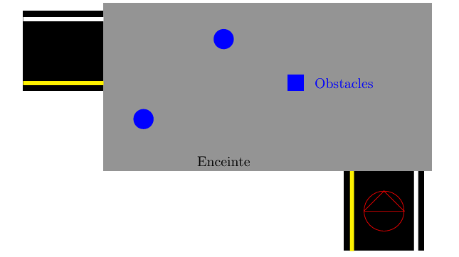

Mission 3: Traversée d'un tunnel
=================================

Description de l'épreuve
------------------------

L'objectif de cette mission est de permettre au robot de naviguer à travers une enceinte fermée avec des contraintes spécifiques :

1. **Entrée de l'enceinte**
   - Détecter l'ouverture d'entrée
   - Pénétrer sans heurter les montants

2. **Navigation intérieure**
   - Trouver l'issue de sortie
   - Sortir de l'enceinte sans toucher les murs
   - Temps limite : 1 minute

3. **Variante avec obstacles**
   - Répéter les étapes précédentes en présence d'obstacles à l'intérieur de l'enceinte

Architecture du système
----------------------

Noeud Maître (Master Node)
~~~~~~~~~~~~~~~~~~~~~~~~~

Le ``master_node`` joue un rôle central de coordination. Il contrôle le démarrage et l'arrêt des différentes phases de la mission en publiant des commandes sur le topic ``/command``.

Noeuds de Contrôle
~~~~~~~~~~~~~~~~~

**Noeud d'évitement (wall_follower_node)**

- Responsable de la navigation le long des murs
- Utilise les données du Lidar pour déterminer la trajectoire, en détectant les differents obstacles
- Implémente une logique de suivi de mur dynamique

Logique de Navigation
--------------------

La navigation repose sur plusieurs principes clés :

1. **Détection des obstacles**

   - Segmentation du champ de vision laser en secteurs
   - Analyse des distances dans différentes directions

2. **Stratégies de mouvement**
   
   - Suivi de mur droit
   - Ajustement proportionnel à la distance du mur
   - Rotation en cas d'obstacle frontal

Node Graph
^^^^^^^^^^

.. image:: pictures/mission2_graph.png
   :alt: node_graph mission3
   :width: 600
   :align: center

Démonstration 
---------------------

Programmes 
---------------------

Lancement de la Mission 3 : 
^^^^^^^^^^^^^^^^^^^^^^^^^^^^

.. code-block:: bash

    roslaunch tournoi mission3.launch

Fichier launch
^^^^^^^^^^^^^^

.. code-block:: xml

    <launch>
        <arg name="mode" default="default_value"/>
        <node pkg="tournoi" name="master_node" 
              type="master_node_3.py" 
              output="screen" 
              required="false" 
              respawn="false">
        </node>
        <node pkg="tournoi" name="wall_follower_node" 
              type="wall_follower.py" 
              output="screen" 
              required="false" 
              respawn="false">
        </node>
    </launch>

master_node_3.py
^^^^^^^^^^^^^^^^

.. code-block:: bash

    #!/usr/bin/env python
    # -*- coding: utf-8 -*-
    # Author: PALISSE Volia, WAECHTER Thibaut, YOUBI Lounès

    import rospy
    from std_msgs.msg import UInt8
    import sys
    import select
    import termios
    import tty
    import signal

    class MasterNode:
        def __init__(self):
            # Initialisation du publisher et subscriber
            self.pub_command = rospy.Publisher('/command', UInt8, queue_size=1)
            self.sub_command = rospy.Subscriber('/command', UInt8, self.command_callback, queue_size=1)
            self.command_state = 0  # 0 = désactivé, 1 = activé
            self.settings = termios.tcgetattr(sys.stdin)
            
            rospy.loginfo(f"\nÉtat initial de la commande: {self.command_state}")

        def command_callback(self, command_msg):
            self.command_state = command_msg.data
            rospy.loginfo(f"\nNouvelle valeur de commande reçue: {self.command_state}")

        def get_key(self):
            try:
                tty.setraw(sys.stdin.fileno())
                rlist, _, _ = select.select([sys.stdin], [], [], 0.1)
                if rlist:
                    key = sys.stdin.read(1)
                else:
                    key = ''
            finally:
                termios.tcsetattr(sys.stdin, termios.TCSADRAIN, self.settings)
            return key

        def run(self):
            rospy.loginfo("\nAppuyez sur ESPACE pour alterner l'état du topic /command entre 0 et 1")
            
            while not rospy.is_shutdown():
                key = self.get_key()
                
                if key == ' ':
                    self.command_state = 1 if self.command_state == 0 else 0
                    rospy.loginfo(f"Command: {self.command_state}")
                    self.pub_command.publish(self.command_state)
                elif key == '\x03':  # Ctrl+C
                    rospy.loginfo("\nArrêt du robot.")
                    termios.tcsetattr(sys.stdin, termios.TCSADRAIN, self.settings)
                    rospy.signal_shutdown("\nArrêt demandé par l'utilisateur")
                    break

    def main():
        rospy.init_node('master_node')
        
        try:
            node = MasterNode()
            node.run()
        except rospy.ROSInterruptException:
            termios.tcsetattr(sys.stdin, termios.TCSADRAIN, node.settings)
        except Exception as e:
            rospy.logerr(f"Erreur: {str(e)}")
            termios.tcsetattr(sys.stdin, termios.TCSADRAIN, termios.tcgetattr(sys.stdin.fileno()))

    if __name__ == '__main__':
        main()

wall_follower.py
^^^^^^^^^^^^^^^^

.. code-block:: bash

    #!/usr/bin/env python3
    import rospy
    from geometry_msgs.msg import Twist
    from sensor_msgs.msg import LaserScan
    from std_msgs.msg import UInt8
    import math

    class WallFollower:
        def __init__(self):
            rospy.init_node('wall_follower')
            
            self.DESIRED_WALL_DIST = 0.5  # Distance désirée du mur
            self.WALL_DIST_TOLERANCE = 0.1
            self.DESIRED_FRONT_DIST = 0.3
            
            self.LINEAR_SPEED = 0.1
            self.ANGULAR_SPEED = 0.5
            
            self.is_active = False
            
            self.cmd_vel_pub = rospy.Publisher('/cmd_vel', Twist, queue_size=1)
            self.scan_sub = rospy.Subscriber('/scan', LaserScan, self.scan_callback)
            self.command_sub = rospy.Subscriber('/command', UInt8, self.command_callback)
            
            self.move_cmd = Twist()

        def command_callback(self, msg):
            self.is_active = msg.data == 1
            if not self.is_active:
                self.stop_robot()

        def filter_ranges(self, ranges, range_min, range_max):
            """Filtrer les distances valides."""
            return [x for x in ranges if range_min < x < range_max]

        def scan_callback(self, scan_data):
            if not self.is_active:
                return
            
            # Analyse des distances
            front_center = scan_data.ranges[355:360] + scan_data.ranges[0:5]
            front_left = scan_data.ranges[5:25]
            front_right = scan_data.ranges[335:355]
            side_left = scan_data.ranges[25:45]
            side_right = scan_data.ranges[315:335]
            
            # Filtrage des distances
            front_center_dist = min(self.filter_ranges(front_center, scan_data.range_min, scan_data.range_max) or [float('inf')])
            front_left_dist = min(self.filter_ranges(front_left, scan_data.range_min, scan_data.range_max) or [float('inf')])
            front_right_dist = min(self.filter_ranges(front_right, scan_data.range_min, scan_data.range_max) or [float('inf')])
            side_left_dist = min(self.filter_ranges(side_left, scan_data.range_min, scan_data.range_max) or [float('inf')])
            side_right_dist = min(self.filter_ranges(side_right, scan_data.range_min, scan_data.range_max) or [float('inf')])
            
            # Logs pour le débogage
            rospy.loginfo(f"Distances: FrontCenter={front_center_dist:.2f}, FrontLeft={front_left_dist:.2f}, "
                        f"FrontRight={front_right_dist:.2f}, SideLeft={side_left_dist:.2f}, SideRight={side_right_dist:.2f}")
            
            self.navigate(front_center_dist, front_left_dist, front_right_dist, side_left_dist, side_right_dist)

        def navigate(self, front_center_dist, front_left_dist, front_right_dist, side_left_dist, side_right_dist):
            linear_speed = self.LINEAR_SPEED
            angular_speed = 0.0
            
            if front_center_dist < self.DESIRED_FRONT_DIST:
                rospy.loginfo("Obstacle devant, tourner à gauche.")
                linear_speed = 0.0
                angular_speed = self.ANGULAR_SPEED
            elif side_right_dist == float('inf'):
                rospy.loginfo("Pas de mur détecté à droite, cherche un mur.")
                linear_speed = self.LINEAR_SPEED
                angular_speed = -self.ANGULAR_SPEED
            else:
                error = self.DESIRED_WALL_DIST - side_right_dist
                if abs(error) > self.WALL_DIST_TOLERANCE:
                    rospy.loginfo(f"Ajustement: Erreur={error:.2f}, Ajuste sa trajectoire.")
                    angular_speed = self.ANGULAR_SPEED * error  # Facteur de correction proportionnel
                else:
                    rospy.loginfo("Suit le mur.")
            
            self.move_cmd.linear.x = linear_speed
            self.move_cmd.angular.z = angular_speed
            self.cmd_vel_pub.publish(self.move_cmd)

        def stop_robot(self):
            rospy.loginfo("Arrêt du robot.")
            self.move_cmd.linear.x = 0.0
            self.move_cmd.angular.z = 0.0
            self.cmd_vel_pub.publish(self.move_cmd)

    if __name__ == '__main__':
        try:
            WallFollower()
            rospy.spin()
        except rospy.ROSInterruptException:
            pass

Notes et Considerations
----------------------

- Calibration précise des paramètres de navigation
- Tests incrementaux avec complexité croissante
- Gestion robuste des cas limites