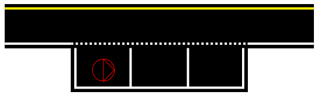

Mission 4 : Parking
===============================================

Durant cette mission, le TurtleBot doit réussir une maneuvre de parking dans la place non occupée parmi les deux disponibles, puis sortir de la place après un délai.

Pour cette mission, nous avons réalisé notre propre code après avoir tenté d'utiliser, sans grand succès, les codes du tutoriel ROBOTIS que vous pouvez retrouver dans le github suivant : https://github.com/ROBOTIS-GIT/turtlebot3_autorace_2020/tree/main 

Nous avons donc exécuté la mission avec les codes du tutoriel ROBOTIS de la manière suivante : 

1 . Fonctionnement du code
-----------------------------

Le but principal de ce code est de se garer à la première place non occupée du parking. Pour se faire, il se place devant la première place et mesure avec son lidar, si un TurtleBot (ou autre objet) s'y trouve, si oui, il se gare à la seconde place, sinon sur la première.

Une fois garé, le TurtleBot marque une pause de 5 secondes avant de se rediriger vers l'entrée du parking.

Note : Cette version du code ne réalise pas la détection du panneau à l'entrée et nécessite ainsi de placer le TrtuelBot du parking avant de lancer la mission.

2 . Code du parking
-----------------------------

.. code-block:: bash

   #!/usr/bin/env python 
   from sensor_msgs.msg import CompressedImage
   from std_msgs.msg import UInt8
   from cv_bridge import CvBridge
   from geometry_msgs.msg import Twist
   from sensor_msgs.msg import LaserScan
   
   import numpy as np
   import rospkg
   import cv2
   import rospy
   
   class MissionPARKING:
       def __init__(self):
           self.test_valeur = 0
           
           rospy.init_node('noeud_parking')
           self.bridge = CvBridge()
           #self.image_sub = rospy.Subscriber('/camera/image', CompressedImage, self.image_callback)
           self.image_sub = rospy.Subscriber('/camera/image_color/compressed', CompressedImage, self.image_callback)
   
           self.command_pub = rospy.Publisher('/command', UInt8, queue_size=10)
           
           # Flag pour gérer l'état de détection
           self.parking_detected = False
           self.command = UInt8()
           
           # Publisher pour les commandes de mouvements
           self.cmd_vel_pub = rospy.Publisher('/cmd_vel', Twist, queue_size=1)
           self.move_cmd = Twist()
           
   
           # Utiliser rospkg pour obtenir le chemin absolu de l'image
           rospack = rospkg.RosPack()
           package_path = rospack.get_path('competition')
           image_path = package_path + '/pictures/damier.png'
   
           # Charger l'image de référence du damier
           try:
               self.reference_image = cv2.imread(image_path, cv2.IMREAD_GRAYSCALE)
               if self.reference_image is None:
                   rospy.logwarn(f"\nErreur lors du chargement de l'image de référence à {image_path}\n")
           except Exception as e:
               rospy.logerr(f"\nErreur lors du chargement de l'image de référence : {e}\n")
               self.reference_image = None
   
       def publish_velocity(self, linear_x, angular_z):
           """Publish velocity commands to move the robot"""
           self.move_cmd.linear.x = -linear_x
           self.move_cmd.angular.z = -angular_z
           self.cmd_vel_pub.publish(self.move_cmd)
   
       #Fonctions de mouvements spécifiques
       def avance(self, k):
           """Move forward for a specified number of iterations"""
           for _ in range(int(2*k)):
               self.publish_velocity(1.3, 0.0)
               rospy.sleep(0.5)
   
       def tourne_gauche(self, k):
           """Turn left for a specified number of iterations"""
           for _ in range(2*k):
               self.publish_velocity(0, -1.7)
               rospy.sleep(0.5)
   
       def tourne_gauche2(self, k):
           """Turn left for a specified number of iterations"""
           for _ in range(2*k):
               self.publish_velocity(0, -1.55)
               rospy.sleep(0.5)
   
       def tourne_droite(self, k):
           """Turn right for a specified number of iterations"""
           for _ in range(2*k):
               self.publish_velocity(0, 1.7)
               rospy.sleep(0.5)
   
       def gare(self):
           try:
               # Séquence d'évitement d'obstacle
               self.avance(2.5)
               #self.avance(2)
               self.tourne_droite(1)
               rospy.sleep(0.7)
               #Le programme attend le prochain message sur le topic '/scan' , par le noeud LaserScan
               message = rospy.wait_for_message('/scan', LaserScan)
               #Réccupération des mesures valides
               valid_ranges = [r for r in message.ranges if r != float('inf') and r > 0]
               print(valid_ranges[0])
               if valid_ranges[0] < 0.3:
                   # Si la première place est occupée
                   rospy.loginfo("Place occupée !!!")
                   self.tourne_gauche(1)
                   self.avance(1.5)
                   self.tourne_droite(1)
                   self.avance(1)
                   self.tourne_gauche(1)
                   rospy.sleep(5)
                   self.tourne_gauche(1)
                   self.avance(1)
                   self.tourne_gauche2(1)
                   self.avance(4)
               else:
                   # Si la première place est libre
                   rospy.loginfo("Place libre ;)")
                   self.avance(1)
                   self.tourne_gauche(1)
                   rospy.sleep(5)
                   self.tourne_gauche(1)
                   self.avance(1)
                   self.tourne_gauche2(1)
                   self.avance(2.5)
               rospy.sleep(30)
   
               
               rospy.loginfo("Obstacle évité!")
           except rospy.ROSInterruptException:
               pass
   
       def image_callback(self, data):
           """Callback function for processing camera images"""
           try:
               np_arr = np.frombuffer(data.data, np.uint8)
               cv_image = cv2.imdecode(np_arr, cv2.IMREAD_GRAYSCALE)
           except Exception as e:
               rospy.logerr(f"\nErreur lors du traitement de l'image : {e}\n")
               return
   
           if self.reference_image is not None:
               # Redimensionner l'image de référence à la taille de l'image reçue
               ref_image = cv2.resize(self.reference_image, (cv_image.shape[1], cv_image.shape[0]))
   
               # Comparer l'image du topic avec l'image de référence
               result = cv2.matchTemplate(cv_image, ref_image, cv2.TM_CCOEFF_NORMED)
               min_val, max_val, min_loc, max_loc = cv2.minMaxLoc(result)
               print(max_val)
               
               # Track the maximum correlation value
               if self.test_valeur < max_val:
                   rospy.loginfo(f"Correlation value: {max_val}")
                   self.test_valeur = max_val
   
               max_val=1
               # Si le score de correspondance est élevé, on détecte le panneau parking
               if max_val > 0:  # Ajustez cette valeur selon vos besoins
                   if not self.parking_detected:
                       rospy.loginfo("\rPanneau parking détecté, lancement du code pour se garer\n")
                       self.parking_detected = True
                       
                       # Appeler la méthode de stationnement
                       self.gare()
   
                       rospy.sleep(5)  # Délai en secondes
                       
                       # Publier la commande d'arrêt
                       self.publish_command(0)
                       rospy.loginfo("\nMission 4 terminée\n")
   
       def publish_command(self, value):
           """Publish a command value"""
           self.command.data = value
           self.command_pub.publish(self.command)
   
       def run(self):
           """Main run method to keep the node running"""
           rate = rospy.Rate(10)
           while not rospy.is_shutdown():
               rate.sleep()
   
   if __name__ == '__main__':
       try:
           parking = MissionPARKING()
           parking.run()
       except rospy.ROSInterruptException:
           pass

3. Étapes pour exécuter la mission
---------------------------------------------

Il faut commencer en démarrant ROS grâce à cette commande à éxécuter sur l'ordinateur : 

.. code-block:: bash

    roscore

Dans un second temps, ouvrez un terminal sur la RaspeberryPi (via SSH) du TurtleBot pour utiliser la commande suivante qui permet de lancer les configurations spécifiques pour le démarrage du robot TurtlBot3 : 

.. code-block:: bash

    roslaunch turtlebot3_bringup turtlebot3_robot.launch

Puis dans un second terminal sur le robot ouvert via SSH, lancez le noeud de publication des images de la caméra par la RaspberryPi embarquée dans le TurtleBot :

.. code-block:: bash

   roslaunch turtlebot3_autorace_camera raspberry_pi_camera_publish.launch

Ensuite, ouvrez un nouveau terminal, sur le navigateur cette fois-ci, pour lancer le noeud de calibration de la caméra intrinsèque puis celui de la calibration extrinsèque :

.. code-block:: bash

   roslaunch turtlebot3_autorace_camera intrinsic_camera_calibration.launch

.. code-block:: bash

   roslaunch turtlebot3_autorace_camera extrinsic_camera_calibration.launch

Finalement, dans un dernier terminal, entrez la commande permettant d'éxécuter la mission construction :

.. code-block:: bash

   rosrun competition mission_parking.py

Piste d'amélioration :
---------------------------------------------

Ce code a été réalisé le deuxième jour de compétition, quelques minutes avant le passage. Il nécessite ainsi des améliorations, auxquelle nous avons pris la peine de réfléchir.

- Parfois, certaines mesures du Lidar sont défaillantes, ce qui ne permet pas de mesurer la distance souhaitée étant donné que le noeud qui envoi les données n'intègre pas de pré filtrage dans celui-ci. Ainsi, on peut envisager lors de la mesure ponctuelle de distance, appliquer un filtrage en exigeant une valeur ni nulle ni infinie (égale à 'inf').

- On peut aussi envisager prendre en compte un plus large éventail de mesures comme par exemple celle des distances entre -5° et +5°, et conserver la plus petite distance mesurée comme celle étant la distance de l'obstacle devant.

- Il serait également pertinent de profiter du fait que le lidar peut réaliser un scan à 360 degrès. Il n'est donc pas nécessaire de tourner le TurtleBot afin de vérifier si l'emplacement est occupé.

- Enfin, à terme, il est souhaitable d'intégrer le code de détection de panneau (défaillant durant la compétition) et celui de suivi de ligne au fonctionnement deu code de parking.
