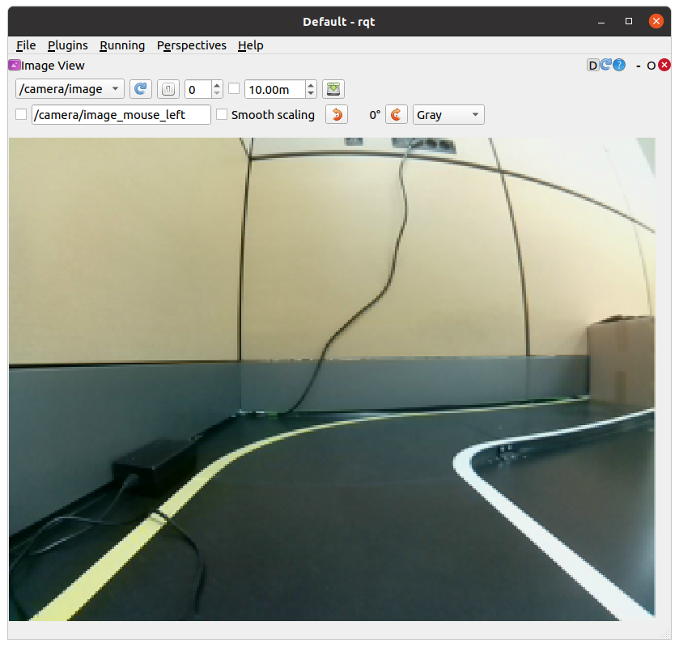

Installation des caméras
========================

Cette partie explique comment mettre en place la caméra : la partie hardware et la partie software.
---------------------------------------------------------------------------------------------------

HARDWARE

Nous considérons que la caméra choisie est un caméra de type FishEye compatible avec RaspberryPi.

1. Connecter la caméra FishEye à l'emplacement correspondant sur la RaspberryPi.
2. Fixer la caméra sur la structure du robot, de préférence sur l'avant du robot. Vous pouvez vous aidez d'un des modules suivants pour installer la caméra sur lr robot.

- Pièce 3D custom : 
  Téléchargez ce fichier via `ce lien <https://file.io/YCmzrXh2jZ27>`_.

.. image:: support_camera_tostain.png
   :alt: node_graph mission1
   :width: 200
   :align: center

- Pièce 3D pour le support de la caméra fournie par les organisateurs de la compétition URRMC :
  Téléchargez le fichier via `ce lien <https://file.io/srEicsKNcDTi>`_.

.. list-table:: 
   :widths: 50 50
   :align: center

   * - .. image:: support_cam_image.png
         :alt: node_graph mission1
         :width: 200
     - .. image:: angle_cam_images.png
         :alt: node_graph mission1
         :width: 200

SOFTWARE

Prérequis
---------

Installation des paquets et calibration de la caméra
~~~~~~~~~~~~~~~~~~~~~~~~~~~~~~~~~~~~~~~~~~~~~~~~~~~~

Les instructions suivantes décrivent comment installer les paquets et calibrer une caméra.

Installation du paquet AutoRace sur le PC distant et le SBC
^^^^^^^^^^^^^^^^^^^^^^^^^^^^^^^^^^^^^^^^^^^^^^^^^^^^^^^^^^

Clonez et compilez le dépôt AutoRace :

.. code-block:: bash

   $ cd ~/catkin_ws/src/
   $ git clone -b noetic https://github.com/ROBOTIS-GIT/turtlebot3_autorace_2020.git
   $ cd ~/catkin_ws && catkin_make

Installation des paquets dépendants supplémentaires sur le SBC
^^^^^^^^^^^^^^^^^^^^^^^^^^^^^^^^^^^^^^^^^^^^^^^^^^^^^^^^^^^^^^

Créez un fichier de swap pour éviter un manque de mémoire lors de la compilation d'OpenCV :

.. code-block:: bash

   $ sudo fallocate -l 4G /swapfile
   $ sudo chmod 600 /swapfile
   $ sudo mkswap /swapfile
   $ sudo swapon /swapfile

Installez les dépendances nécessaires :

.. code-block:: bash

   $ sudo apt-get update
   $ sudo apt-get install build-essential cmake gcc g++ git unzip pkg-config \
       libjpeg-dev libpng-dev libtiff-dev libavcodec-dev libavformat-dev libswscale-dev \
       libgtk2.0-dev libcanberra-gtk* libxvidcore-dev libx264-dev python3-dev \
       python3-numpy python3-pip libtbb2 libtbb-dev libdc1394-22-dev libv4l-dev \
       v4l-utils libopenblas-dev libatlas-base-dev libblas-dev liblapack-dev \
       gfortran libhdf5-dev libprotobuf-dev libgoogle-glog-dev libgflags-dev \
       protobuf-compiler

Compilation d'OpenCV et opencv_contrib
^^^^^^^^^^^^^^^^^^^^^^^^^^^^^^^^^^^^^^

Téléchargez et extrayez les archives OpenCV :

.. code-block:: bash

   $ cd ~
   $ wget -O opencv.zip https://github.com/opencv/opencv/archive/4.5.0.zip
   $ wget -O opencv_contrib.zip https://github.com/opencv/opencv_contrib/archive/4.5.0.zip

   $ unzip opencv.zip
   $ unzip opencv_contrib.zip

   $ mv opencv-4.5.0 opencv
   $ mv opencv_contrib-4.5.0 opencv_contrib

Créez les fichiers de configuration CMake :

.. code-block:: bash

   $ cd opencv
   $ mkdir build
   $ cd build
   $ cmake -D CMAKE_BUILD_TYPE=RELEASE \
           -D CMAKE_INSTALL_PREFIX=/usr/local \
           -D OPENCV_EXTRA_MODULES_PATH=~/opencv_contrib/modules \
           -D ENABLE_NEON=ON \
           -D BUILD_TIFF=ON \
           -D WITH_FFMPEG=ON \
           -D WITH_GSTREAMER=ON \
           -D WITH_TBB=ON \
           -D BUILD_TBB=ON \
           -D BUILD_TESTS=OFF \
           -D WITH_EIGEN=OFF \
           -D WITH_V4L=ON \
           -D WITH_LIBV4L=ON \
           -D WITH_VTK=OFF \
           -D OPENCV_ENABLE_NONFREE=ON \
           -D INSTALL_C_EXAMPLES=OFF \
           -D INSTALL_PYTHON_EXAMPLES=OFF \
           -D BUILD_NEW_PYTHON_SUPPORT=ON \
           -D BUILD_opencv_python3=TRUE \
           -D OPENCV_GENERATE_PKGCONFIG=ON \
           -D BUILD_EXAMPLES=OFF ..

La compilation peut prendre une à deux heures :

.. code-block:: bash

   $ cd ~/opencv/build
   $ make -j4
   $ sudo make install
   $ sudo ldconfig
   $ make clean
   $ sudo apt-get update

Configuration de la Raspberry Pi
^^^^^^^^^^^^^^^^^^^^^^^^^^^^^

Éteignez la Raspberry Pi, retirez la carte microSD et modifiez le fichier config.txt dans la section system-boot. Ajoutez :

.. code-block::

   start_x=1

avant la ligne :

.. code-block::

   enable_uart=1

Installez FFmpeg et testez la capture vidéo :

.. code-block:: bash

   $ sudo apt install ffmpeg
   $ ffmpeg -f video4linux2 -s 640x480 -i /dev/video0 -ss 0:0:2 -frames 1 capture_test.jpg

Installation de paquets ROS supplémentaires
^^^^^^^^^^^^^^^^^^^^^^^^^^^^^^^^^^^^^^^^^^

Sur le SBC :

.. code-block:: bash

   $ sudo apt install ros-noetic-cv-camera

Sur le PC distant :

.. code-block:: bash

   $ sudo apt install ros-noetic-image-transport ros-noetic-image-transport-plugins \
       ros-noetic-cv-bridge ros-noetic-vision-opencv python3-opencv libopencv-dev \
       ros-noetic-image-proc ros-noetic-cv-camera ros-noetic-camera-calibration

Calibration de la caméra
------------------------

Étalonnage de l'imagerie de la caméra
~~~~~~~~~~~~~~~~~~~~~~~~~~~~~~~~~~~~~

1. Lancer `roscore` sur le PC distant
  
.. code-block:: bash

      $ roscore

2. Activer la caméra sur le SBC (Single Board Computer)
   
.. code-block:: bash

      $ roslaunch turtlebot3_autorace_camera raspberry_pi_camera_publish.launch

3. Exécuter `rqt_image_view` sur le PC distant
   
.. code-block:: bash

      $ rqt_image_view

