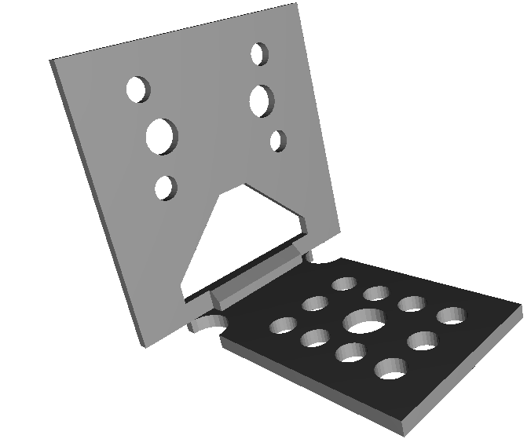
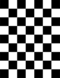
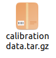
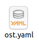
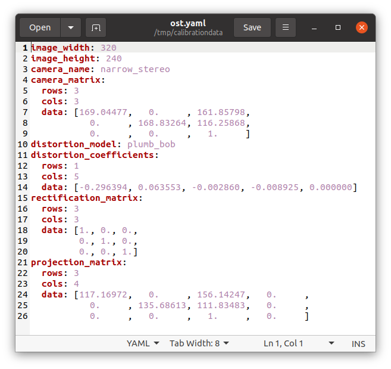
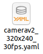
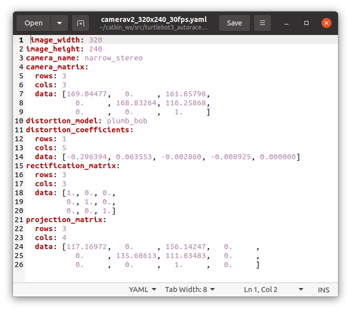
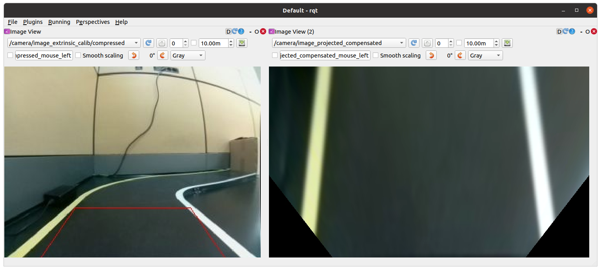
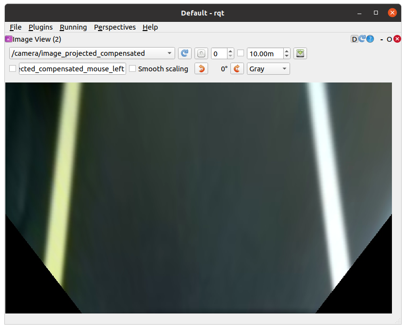

Installation des caméras
========================

**Cette partie explique comment mettre en place la caméra : la partie hardware et la partie software.**

HARDWARE

Nous considérons que la caméra choisie est un caméra de type FishEye compatible avec RaspberryPi.

1. Connecter la caméra FishEye à l'emplacement correspondant sur la RaspberryPi.
2. Fixer la caméra sur la structure du robot, de préférence sur l'avant du robot. Vous pouvez vous aidez d'un des modules suivants pour installer la caméra sur lr robot.

- Pièce 3D custom : 
  Téléchargez ce fichier via `ce lien <https://file.io/YCmzrXh2jZ27>`_.

- Pièce 3D pour le support de la caméra fournie par les organisateurs de la compétition URRMC :
  Téléchargez le fichier via `ce lien <https://file.io/srEicsKNcDTi>`_.

.. list-table:: 
   :widths: 50 50
   :align: center

   * - .. image:: support_cam_image.png
         :alt: node_graph mission1
         :width: 200
     - .. image:: angle_cam_images.png
         :alt: node_graph mission1
         :width: 200

SOFTWARE

Prérequis
---------

Installation des paquets et calibration de la caméra
~~~~~~~~~~~~~~~~~~~~~~~~~~~~~~~~~~~~~~~~~~~~~~~~~~~~

Les instructions suivantes décrivent comment installer les paquets et calibrer une caméra.

Installation du paquet AutoRace sur le PC distant et le SBC
^^^^^^^^^^^^^^^^^^^^^^^^^^^^^^^^^^^^^^^^^^^^^^^^^^^^^^^^^^

Clonez et compilez le dépôt AutoRace :

.. code-block:: bash

   $ cd ~/catkin_ws/src/
   $ git clone -b noetic https://github.com/ROBOTIS-GIT/turtlebot3_autorace_2020.git
   $ cd ~/catkin_ws && catkin_make

Installation des paquets dépendants supplémentaires sur le SBC
^^^^^^^^^^^^^^^^^^^^^^^^^^^^^^^^^^^^^^^^^^^^^^^^^^^^^^^^^^^^^^

Créez un fichier de swap pour éviter un manque de mémoire lors de la compilation d'OpenCV :

.. code-block:: bash

   $ sudo fallocate -l 4G /swapfile
   $ sudo chmod 600 /swapfile
   $ sudo mkswap /swapfile
   $ sudo swapon /swapfile

Installez les dépendances nécessaires :

.. code-block:: bash

   $ sudo apt-get update
   $ sudo apt-get install build-essential cmake gcc g++ git unzip pkg-config \
       libjpeg-dev libpng-dev libtiff-dev libavcodec-dev libavformat-dev libswscale-dev \
       libgtk2.0-dev libcanberra-gtk* libxvidcore-dev libx264-dev python3-dev \
       python3-numpy python3-pip libtbb2 libtbb-dev libdc1394-22-dev libv4l-dev \
       v4l-utils libopenblas-dev libatlas-base-dev libblas-dev liblapack-dev \
       gfortran libhdf5-dev libprotobuf-dev libgoogle-glog-dev libgflags-dev \
       protobuf-compiler

Compilation d'OpenCV et opencv_contrib
^^^^^^^^^^^^^^^^^^^^^^^^^^^^^^^^^^^^^^

Téléchargez et extrayez les archives OpenCV :

.. code-block:: bash

   $ cd ~
   $ wget -O opencv.zip https://github.com/opencv/opencv/archive/4.5.0.zip
   $ wget -O opencv_contrib.zip https://github.com/opencv/opencv_contrib/archive/4.5.0.zip

   $ unzip opencv.zip
   $ unzip opencv_contrib.zip

   $ mv opencv-4.5.0 opencv
   $ mv opencv_contrib-4.5.0 opencv_contrib

Créez les fichiers de configuration CMake :

.. code-block:: bash

   $ cd opencv
   $ mkdir build
   $ cd build
   $ cmake -D CMAKE_BUILD_TYPE=RELEASE \
           -D CMAKE_INSTALL_PREFIX=/usr/local \
           -D OPENCV_EXTRA_MODULES_PATH=~/opencv_contrib/modules \
           -D ENABLE_NEON=ON \
           -D BUILD_TIFF=ON \
           -D WITH_FFMPEG=ON \
           -D WITH_GSTREAMER=ON \
           -D WITH_TBB=ON \
           -D BUILD_TBB=ON \
           -D BUILD_TESTS=OFF \
           -D WITH_EIGEN=OFF \
           -D WITH_V4L=ON \
           -D WITH_LIBV4L=ON \
           -D WITH_VTK=OFF \
           -D OPENCV_ENABLE_NONFREE=ON \
           -D INSTALL_C_EXAMPLES=OFF \
           -D INSTALL_PYTHON_EXAMPLES=OFF \
           -D BUILD_NEW_PYTHON_SUPPORT=ON \
           -D BUILD_opencv_python3=TRUE \
           -D OPENCV_GENERATE_PKGCONFIG=ON \
           -D BUILD_EXAMPLES=OFF ..

La compilation peut prendre une à deux heures :

.. code-block:: bash

   $ cd ~/opencv/build
   $ make -j4
   $ sudo make install
   $ sudo ldconfig
   $ make clean
   $ sudo apt-get update

Configuration de la Raspberry Pi
^^^^^^^^^^^^^^^^^^^^^^^^^^^^^

Éteignez la Raspberry Pi, retirez la carte microSD et modifiez le fichier config.txt dans la section system-boot. Ajoutez :

.. code-block::

   start_x=1

avant la ligne :

.. code-block::

   enable_uart=1

Installez FFmpeg et testez la capture vidéo :

.. code-block:: bash

   $ sudo apt install ffmpeg
   $ ffmpeg -f video4linux2 -s 640x480 -i /dev/video0 -ss 0:0:2 -frames 1 capture_test.jpg

Installation de paquets ROS supplémentaires
^^^^^^^^^^^^^^^^^^^^^^^^^^^^^^^^^^^^^^^^^^

Sur le SBC :

.. code-block:: bash

   $ sudo apt install ros-noetic-cv-camera

Sur le PC distant :

.. code-block:: bash

   $ sudo apt install ros-noetic-image-transport ros-noetic-image-transport-plugins \
       ros-noetic-cv-bridge ros-noetic-vision-opencv python3-opencv libopencv-dev \
       ros-noetic-image-proc ros-noetic-cv-camera ros-noetic-camera-calibration

Calibration de la caméra
------------------------

Étalonnage de l'imagerie de la caméra
~~~~~~~~~~~~~~~~~~~~~~~~~~~~~~~~~~~~~

1. Lancer `roscore` sur le PC distant
  
.. code-block:: bash

      $ roscore

2. Activer la caméra sur le SBC (Single Board Computer)
   
.. code-block:: bash

      $ roslaunch turtlebot3_autorace_camera raspberry_pi_camera_publish.launch

3. Exécuter `rqt_image_view` sur le PC distant
   
.. code-block:: bash

      $ rqt_image_view

Calibration de la caméra intrinsèque
~~~~~~~~~~~~~~~~~~~~~~~~~~~~~~~~~~~~

Imprimer un échiquier sur papier format A4. L'échiquier est utilisé pour la calibration intrinsèque de la caméra.

L'échiquier est stocké à l'emplacement suivant : `turtlebot3_autorace_camera/data/checkerboard_for_calibration.pdf`

Modifiez la valeur des paramètres dans le fichier suivant : `turtlebot3_autorace_camera/launch/intrinsic_camera_calibration.launch`

Pour des informations détaillées sur la calibration de la caméra, consultez le manuel de Calibration de la caméra sur le Wiki ROS.

1. Lancer 'roscore' sur le PC distant :

.. code-block:: bash

      $ roscore

2. Activer la caméra sur le SBC (Single Board Computer) :
   
.. code-block:: bash

      $ roslaunch turtlebot3_autorace_camera raspberry_pi_camera_publish.launch

3. Exécuter le fichier de lancement de la calibration intrinsèque de la caméra sur le PC distant :
   
.. code-block:: bash

      $ roslaunch turtlebot3_autorace_camera intrinsic_camera_calibration.launch mode:=calibration

4. Utilisez l'échiquier pour calibrer la caméra et cliquez sur **CALIBRER**.

.. image:: interface_calib_camera.png
   :alt: node_graph mission1
   :width: 300
   :align: center

5. Cliquez sur **SAVE** pour enregistrer les données de calibration intrinsèque.

.. image:: interface_calib_camera2.png
   :alt: node_graph mission1
   :width: 300
   :align: center

6. Un dossier 'calibrationdata.tar.gz' sera créé dans le dossier '/tmp'.

7. Extraire le fichier 'calibrationdata.tar.gz'' et ouvrez le fichier 'ost.yaml'.

8. Copier et coller les données de 'ost.yaml' vers 'camerav2_320x240_30fps.yaml'.

Calibration de la caméra extrinsèque
~~~~~~~~~~~~~~~~~~~~~~~~~~~~~~~~~~~~

1. Lancer `roscore` sur le PC distant :
  
.. code-block:: bash

      $ roscore

2. Activer la caméra sur le SBC (Single Board Computer) :
   
.. code-block:: bash

      $ roslaunch turtlebot3_autorace_camera raspberry_pi_camera_publish.launch

3. Utiliser la commande sur le PC distant :
   
.. code-block:: bash

      $ roslaunch turtlebot3_autorace_camera intrinsic_camera_calibration.launch mode:=action

4. Lancer le fichier de calibration extrinsèque de la caméra sur le PC distant :
   
.. code-block:: bash

      $ roslaunch turtlebot3_autorace_camera extrinsic_camera_calibration.launch mode:=calibration

5. Exécuter `rqt` sur le PC distant :
   
.. code-block:: bash

      $ rqt

6. Cliquez sur `Plugins > Visualization > Image view` ; plusieurs fenêtres seront ouvertes.

7. Sélectionner les sujets `/camera/image_extrinsic_calib/compressed` et `/camera/image_projected_compensated` sur chaque moniteur.  
   L'une des deux fenêtres affichera une image avec un rectangle rouge. L'autre affichera la vue projetée au sol (vue de dessus).

.. image:: before_extrinsic_calibration.png
   :alt: node_graph mission1
   :width: 650
   :align: center

8. Vérification des sujets
   - `/camera/image_extrinsic_calib/compressed`
   - `/camera/image_projected_compensated`

9. Exécuter `rqt_reconfigure` sur le PC distant :
   
.. code-block:: bash

      $ rosrun rqt_reconfigure rqt_reconfigure

10. Ajuster les paramètres dans `/camera/image_projection` et `/camera/image_compensation_projection`.
    - Modifier la valeur du paramètre `/camera/image_projection` affecte le sujet `/camera/image_extrinsic_calib/compressed`.
    - La calibration intrinsèque de la caméra transformera l'image entourée par le rectangle rouge et affichera l'image comme vue du dessus de la voie.

.. image:: extrinsic_calibration_param.png
   :alt: node_graph mission1
   :width: 650
   :align: center

Vérifier le résultat de l'étalonnage
~~~~~~~~~~~~~~~~~~~~~~~~~~~~~~~~~~~~

Lorsque vous avez terminé toute la calibration de la caméra (Calibration d'Imagerie de la Caméra, Calibration Intrinsèque, Calibration Extrinsèque), assurez-vous que la calibration a été correctement appliquée à la caméra.
Les instructions suivantes décrivent les paramètres pour la reconnaissance.

1. Lancer `roscore` sur le PC distant :
   
.. code-block:: bash

      $ roscore

2. Activer la caméra sur le SBC (Single Board Computer) :
   
.. code-block:: bash

      $ roslaunch turtlebot3_autorace_camera raspberry_pi_camera_publish.launch

3. Exécuter le fichier de lancement de la calibration intrinsèque de la caméra sur le PC distant :
   
.. code-block:: bash

      $ roslaunch turtlebot3_autorace_camera intrinsic_camera_calibration.launch mode:=action

4. Ouvrir un terminal et utiliser la commande sur le PC distant :
   
.. code-block:: bash

      $ roslaunch turtlebot3_autorace_camera extrinsic_camera_calibration.launch mode:=action

5. Exécuter `rqt` sur le PC distant :
   
.. code-block:: bash

      $ rqt

6. Exécuter `rqt_reconfigure`.

À partir de maintenant, les descriptions suivantes concerneront principalement l'ajustement du détecteur de caractéristiques / du filtre de couleur pour la reconnaissance d'objets. Chaque ajustement effectué à partir d'ici est indépendant des autres processus. Cependant, si vous souhaitez ajuster chaque paramètre de manière séquentielle, complétez chaque ajustement parfaitement, puis continuez vers le suivant.
