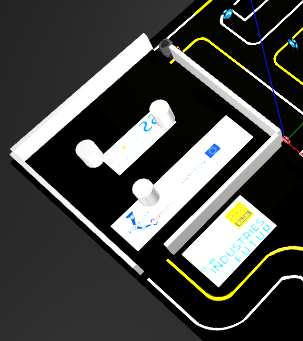
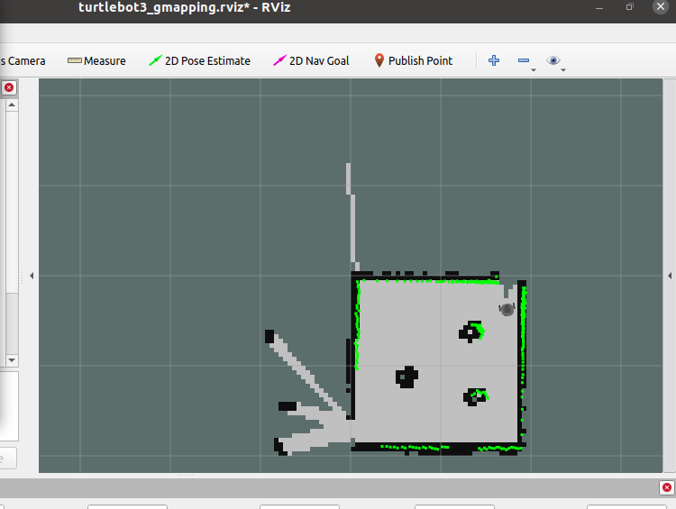
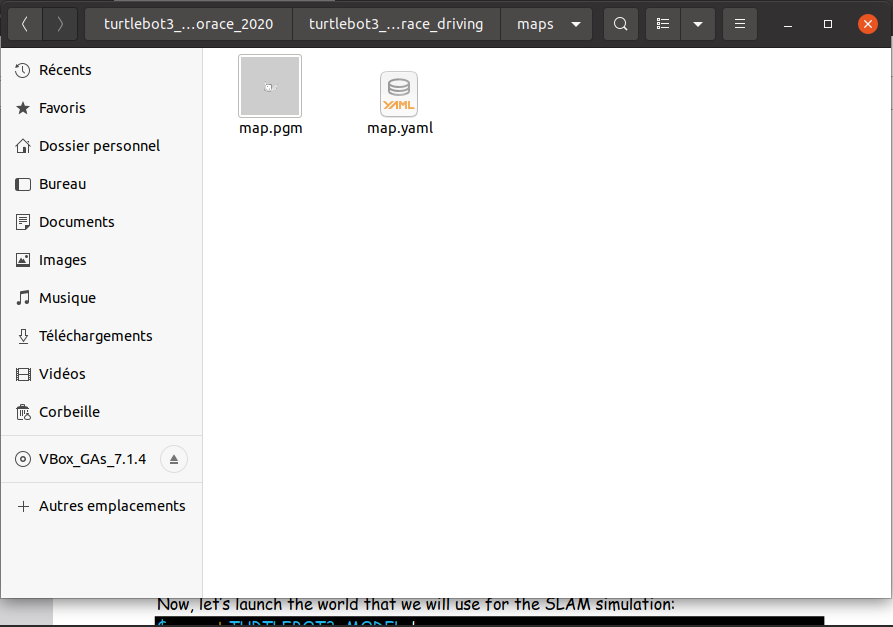

Tunnel
======
Le but de ce Tutoriel est de vous guider à réuissir la mission de Tunnel dans le cadre de turtlebot3_autorace

Prérequis
---------
- Robot Turtlebot3
- ROS Noetic installé
- Gazebo
- RVIZ
- Package turtlebot3_autorace
- Package turtlebot3_autorace2020

Création du map :
------------
Tout d'abord nous allons commencer par créer une map de notre tunnel, et pour faire ca nous allons utiliser la tehcnique SLAM(Simultaneous Localization and Mapping). 

1. Lancer Gazebo
~~~~~~~~~~~~~~~~ 
Terminal 1 : Ouvrez un terminal et exécutez la commande suivante pour lancer l'environnement Gazebo :

.. code-block:: bash

    export TURTLEBOT3_MODEL=burger
    roslaunch turtlebot3_gazebo turtlebot3_circuit_competition.launch

2. Lancer Teleoperation
~~~~~~~~~~~~~~~~~~~~~~~ 
Terminal 2 : Ouvrez un nouveau terminal et exécuter les commandes suivantes  :

.. code-block:: bash

    export TURTLEBOT3_MODEL=burger
    roslaunch turtlebot3_teleop turtlebot3_teleop_key.launch

faites avancer votre Robot jusqu'à l'entrée du Tunnel 

3. SLAM Node 
~~~~~~~~~~~~~~~~~~~~~~~ 
Terminal 3 : Ouvrez un nouveau terminal et exécuter les commandes suivantes :

.. code-block:: bash

    export TURTLEBOT3_MODEL=burger
    roslaunch turtlebot3_slam turtlebot3_slam.launch slam_methods:=gmapping

après l'exécution de cette ligne , RVIZ sera lancé, maintenat à l'aide de teleop déjà lancée dans terminal 2 vous devez parcourir le Tunnel afin de créer une map de ce dernier 

Après avoir crée le map du Tunnel , vous pouvez l'enregistrer à l'aide de la ligne suivante :

.. code-block:: bash

    rosrun map_server map_saver -f ~/catkin_ws/src//turtlebot3_autorace/turtlebot3_autorace_driving/maps/
    
suite à l'enregistrement du map vous devez avoir les deux fichiers dans le chemin spécifié

avant de passer au test vous devez reconstruire votre espace de travail , si vous travaillez sur Catkin_ws :

.. code-block:: bash

    cd ~/catkin_ws
    catkin_make

maintenant vous fermez tous les terminaux .

Exécution de la mission Tunnel  :
------------------------------

1. Lancer Gazebo
~~~~~~~~~~~~~~~~ 

dans un nouveau terminal , pour lancer Gazebo 

.. code-block:: bash

    export TURTLEBOT3_MODEL=burger
    roslaunch turtlebot3_gazebo turtlebot3_circuit_competition.launch

2.lancer intrinsic calibration 
~~~~~~~~~~~~~~~~~~~~~~~~~~~~~~~~~
dans un nouveau terminal , pour lancer la calibration 

.. code-block:: bash

        roslaunch turtlebot3_autorace_camera intrinsic_camera_calibration.launch

3. Lancer Teleoperation
~~~~~~~~~~~~~~~~~~~~~~~ 
ouvrir un nouveau terminal , pour rendre votre Robot devant le panneau "Tunnel"

.. code-block:: bash

    export TURTLEBOT3_MODEL=burger
    roslaunch turtlebot3_teleop turtlebot3_teleop_key.launch

4.lancer la node autorace_core 
~~~~~~~~~~~~~~~~~~~~~~~~~~~~~~
dans un nouveau terminal , lancer la node autorace_node avec la mission tunnel 

.. code-block:: bash

    roslaunch turtlebot3_autorace_core turtlebot3_autorace_core.launch mission:=tunnel

et dans un dernier terminal :

.. code-block:: bash

    rostopic pub -1 /core/decided_mode std_msgs/UInt8 "data: 2"
